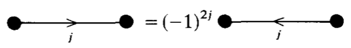
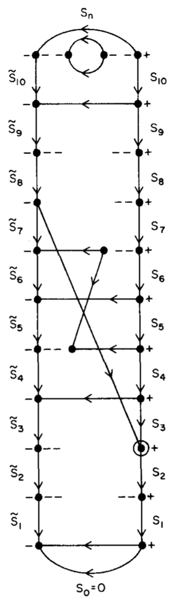

.. only:: html

    .. math::
        \renewenvironment{equation*}
        {\begin{equation}\begin{aligned}}
        {\end{aligned}\end{equation}}
        \renewcommand{\gg}{>\!\!>}
        \renewcommand{\ll}{<\!\!<}
        \newcommand{\I}{\mathrm{i}}
        \newcommand{\D}{\mathrm{d}}
        \renewcommand{\C}{\mathrm{C}}
        \newcommand{\dt}{\frac{\D}{\D t}}
        \newcommand{\E}{\mathrm{e}}
        \renewcommand{\bm}{\boldsymbol}
        \require{mediawiki-texvc}

.. note::
    Payne, P.W., 1982. Matrix element factorization in the unitary group approach for configuration interaction calculations. *International Journal of Quantum Chemistry*, 22(6), 1085-1152.

用于组态相互作用计算的酉群方法中的矩阵元分解
==============================================

摘要
----

图解自旋代数技术用于推导一电子和二电子激发算子的自旋自适应矩阵元素的分段分解公式。自旋适应基由 Yamanouchi-Kotani 基因耦合方法形成，因此构成了 Gel'fand 和 Tsetlin 规定的酉群 U(N) 的不可约基。本文与最近发表的类似工作有几个特点。首先，每个细分因子推导的中间步骤都有完整的文档记录。综合表格列出了对可能的分段因素有贡献的自旋图和阶段。其次，已经做出了特殊的努力来区分可以归因于自旋图的部分因子的那些部分和来自轨道的那些部分。因此，本文的结果对于那些希望将图解自旋代数扩展到评估由非正交轨道构建的状态的矩阵元素的人来说应该是有用的。第三，引入了一种新颖的图形方法来跟踪由创建和湮没算子的排列排列引起的相因子变化。这种技术可能有助于将我们的分析扩展到更高的激发。二次量化和图解自旋代数的必要概念是在现场开发的，因此那些对这些方法知之甚少的人应该可以理解目前的推导。

简介
----

组态相互作用或多组态 SCF 计算的效率主要取决于用于求值自旋适应波函数的矩阵元素的程序。
因此，对将矩阵元素表示为因子乘积的技术给予了相当大的关注，因为通常可以同时计算许多矩阵元素的部分。

本文在用于电子结构计算的酉群方法的框架内开发了哈密顿算子矩阵元素的这种分解。
许多工作人员已经概述了这种分析的一般程序 [1-8]，并且最近发表了至少两组与此处开发的相同的细分因素 [7,8]。
通过自旋的图解重新耦合导出矩阵元素分段因子特别简单。
每个这样的细分因素都是两部分的乘积。
一部分来自自旋轨道的创造和湮灭算子的排列和收缩，而另一部分来自自旋重新耦合。
本文与早期文献的主要区别在于我们对自旋和轨道因素的详尽分析。

我们对每个分段因子的自旋和轨道分量的详细推导对于那些希望将该方法扩展到多配置状态或从非正交轨道构建的状态的人来说应该是有用的。
为了使这些点更清楚，假设 :math:`|\phi(S)\rangle` 和 :math:`|\psi(S)\rangle` 是多组态状态，其中每个贡献组态具有相同的自旋谱系 S [这里谱系指的是自旋逐级耦合方式, 暂时理解为2,0的位点可以任意穿插, 都属于同一谱系, 因此谱系只考虑未成对电子耦合方式]。进入二次量子化哈密顿量的激发算子 :math:`\hat{e}` 的矩阵元素可以写为

.. math::
    \langle \psi(S) | \hat{e} |\phi(S)\rangle = F_1 [\psi(S^*), \phi(S^*)] F_2[S]

其中 :math:`S^*` 是一个特定的自旋系谱，相同的轨道因子 F1 可用于所有与该配置兼容的自旋系谱。 等式（1）的实际实现取决于自旋和轨道对酉群段值的贡献之间的明显区别。 本文提出了第一个这样的不同细分因素的汇编，尽管复合细分因素在其他地方可找到。

对于寻求更清楚地理解酉群方法论的面向计算的量子化学家来说，这篇论文也应该具有教学价值。
考虑分段阶段的问题。 在本文后面会变得很明显，酉群段值的符号不是唯一的，因为矩阵元素因子可以乘以相互抵消的相位 [7,8]。
此外，可以选择不同的相位约定来为特定应用的分段因子提供适当的对称性。
或许由于这些原因，现有的文献并没有对分段因素的符号约定进行完整的推导，而是总结了读者可以据以推导已发布符号的规则。
目前的工作与之形成对比，因为每个符号都是明确导出的，并且自旋因子的相位与轨道因子的相位分开处理。

本文采用的方法也认识到，许多读者对二次量子化形式或图解自旋代数只有名义上的理解。
这些学科所需的概念是在现场开发的，因此不需要事先的背景。

对组态相互作用的酉群方法发展的简要历史回顾将为矩阵元素分段因子的推导提供一个背景。
这篇综述的第一步是总结组态相互作用方法的一些一般方面 [9, 10]:

N 个电子的电子构型是通过从总共 n 个轨道的基础中选择 N 个轨道来形成的
根据泡利排除规则，每个轨道可以选择一次或两次。
如此选择的 N 个轨道的乘积乘以 N 个电子的自旋本征函数 [11]，然后将结果反对称。
这样形成的 N 电子波函数称为组态函数。 然后将自旋特征值 :math:`(S, S_z)` 的组态相互作用波函数形成为具有这些相同自旋特征值 :math:`(S, S_z)` 的组态函数的线性组合。[这里, 组态函数是单个 CSF. 组态相互作用波函数是一堆 CSF 的线性组合. ]

酉群方法源于对酉变换 U(n) 的考虑，它混合了 n 个轨道。
酉群 U(n) 的每个元素将组态函数转换为组态函数的线性组合。
因此，由 n 个轨道形成的所有组态函数的集合展开了酉群 U(n) 的表示。

U(n) 的不可约表示的数学性质是在一代人之前由 Gel'fand 和 Tsetlin [12, 13] 开发的。
这些作者考虑了子群链 :math:`U(2) \subset U(3) \cdots \subset U(n-1) \subset U(n)`，
并为 U(n) 的不可约表示建立了规范基。
该规范基的元素称为 Gel'fand 态。
它们具有 U(n) 的基态消减 U(n-1) 的基态的性质。
将此概念应用于电子波函数意味着从 U(n) 的规范基中去除电子 n 会生成 U(n-1) 的规范基。

Gel'fand 和 Tsetlin 还提出了关于不可约规范基态的酉群生成元的矩阵元素的显式公式。
Moshinsky [14] 将 Gel'fand 分析应用于量子力学。
尽管 Moshinsky 主要关注酉群在核多体理论中的应用，但他工作的突出结论与电子结构理论有关。
Moshinsky 指出，酉群的生成元满足与二次量子化形式中使用的创生和湮灭算子相同的李代数。
因此，Gel'fand 矩阵元素公式可以直接翻译成量子化学的语言。

然而，电子结构理论中的 Gel'fand 基础的等价物是什么？
Moshinsky 和 Seligman [15] 解决了这个问题。
他们证明了由 Yamanouchi 和 Kotani [11] 的系谱构造形成的配置状态函数也是规范的 Gel'fand 基状态。
必须选择组态函数的相位，以便基本生成器的矩阵元素为正，这将在稍后阐明。

Paldus [1, 16-17] 优雅地概述了酉群形式主义对电子结构计算的具体适配。
因为泡利排除规则将轨道限制为双重占据，
Paldus 能够大大简化电子 Gel'fand 基态的枚举和一个电子算子的矩阵元素的求值。
这些想法的计算实现得到了 Shavitt 对态和矩阵元素的图形表示的帮助 [3,4]。
舍费尔等人此后一直使用这种图形酉群方法来构建有效的组态相互作用程序 [18]。

图形酉群方法的主要优点是分段算法，它允许同时求值不同类型矩阵元素共有的因素。
在 Shavitt 开发的图中，
矩阵元素 :math:`\langle \psi'|X_i^\dagger X_j^\dagger X_k X_l |\psi\rangle` 由一个循环表示，
该循环从第 (i - 1) 级的尾部延伸到第 l 级，假设 :math:`i\le j \le k \le l` 。
将矩阵元素表示为因子的乘积，其中每个因子与区间 :math:`(i,l)` 中的一个层级相关联。
此外，矩阵元素仅取决于出现在 Shavitt 图上的循环的形状和循环头处的自旋。
因此可以同时计算许多哈密顿矩阵元素。

其他矩阵元素求值技术与酉群方法同步发展，因此 **上述** 酉群方法现在正在修改。
一种特别有用的方法是基于电子自旋的图形重耦合[19,20]。
戈耶等人 [2] 使用自旋重耦合代数来计算单电子算子的矩阵元素，
Drake 和 Schlesinger [5] 讨论了两个电子算子的自旋重耦合。
然而，德雷克和施莱辛格的结果对我们没有用处，因为它们的基态跨越了对称群的不可约表示。
Paldus 和 Boyle [6] 最近提出了将自旋重耦合应用于评估酉群基的矩阵元素。

酉群过程和自旋重耦合都导致公式中的矩阵元素是分段因子乘积的总和。
当需要两个电子算子矩阵元素时，上面概述的酉群方法需要对许多虚拟态求和。
自旋重耦合的结果要简单得多，因为最多有两个分段因子的乘积构成一个矩阵元素[6]。
当这份手稿审稿时，Shavitt 提出了一组双电子分段因子，这些因子是在没有自旋重耦合的情况下得出的 [8]。

这些方法也有几种扩展到 MCSCF 波函数。
例如，Siegbahn 讨论了将 Shavitt 图上的循环分离为外部和内部部分 [21,22]。
内部部分属于参考波函数中存在的那些轨道，而外部部分仅涉及那些电子被激发到的轨道。
Paldus 和 Wormer [23] 已经深入研究了粒子空穴状态的矩阵元素求值问题，
Shavitt 和 Born [24] 解决了类似的问题。

进一步扩展这些程序需要清楚地了解将段值分解为自旋和轨道贡献。本文的目的是展示如何进行这种分离。

自旋适应本征态及其图
--------------------

二次量子化
^^^^^^^^^^

我们的组态相互作用波函数是通过组合 Slater 行列式 :math:`|\Phi\rangle` 构造的，
并且这些 Slater 行列式中的每一个都是自旋轨道的反对称乘积。
各自的自旋轨道表示为 :math:`\phi_{k\sigma}` ，其中 k 是轨道指标，
自旋指标 :math:`\sigma` 可以是 :math:`(+\frac{1}{2})` 或 :math:`(-\frac{1}{2})`。 
斯莱特行列式 :math:`\Phi` 因此写成

.. math::
    |\Phi(1,2,\cdots,N)\rangle = (N!)^{-1/2} \det
    [\phi_{k_1\sigma_1}(1) \phi_{k_2\sigma_2}(2) \cdots \phi_{k_N\sigma_N}(N)].

在二次量子化形式中，Slater 行列式是通过将产生算子的有序乘积应用于真空态 :math:`|0\rangle` 获得的，
其中没有粒子 [注意这里公式最后一个算符指标 M 应改为 N.]

.. math::
    |\Phi(1,2,\cdots,N)\rangle = X^\dagger_{k_1\sigma_1} X^\dagger_{k_2\sigma_2}
        \cdots X^\dagger_{k_N\sigma_N} |0\rangle.

产生算符 :math:`X_{k\sigma}^\dagger` 和 :math:`X_{k'\sigma'}^\dagger` 反对易

.. math::
    X_{k\sigma}^\dagger X_{k'\sigma'}^\dagger +
    X_{k'\sigma'}^\dagger X_{k\sigma}^\dagger = 0,
    :label: guga-eq4

这保证了波函数的反对称。 相应的左矢态是通过按相反顺序应用湮灭算子 :math:`X_{k\sigma}` 到左矢真空态 :math:`\langle 0 |` 获得的，

.. math::
    \langle \Phi(1,2,\cdots,N) | = \langle 0 | X_{k_N\sigma_N} \cdots
        X_{k_2\sigma_2} X_{k_1\sigma_1}.

湮灭算子 :math:`X_{k\sigma}` 和 :math:`X_{k'\sigma'}` 也反对易

.. math::
    X_{k\sigma} X_{k'\sigma'} + X_{k'\sigma'} X_{k\sigma} = 0,

但是产生和湮灭算子的反对易子定义为 [注意这里原文第二项有多处错误]

.. math::
    X_{k\sigma}^\dagger X_{k'\sigma'} + X_{k'\sigma'} X_{k\sigma}^\dagger
        = \delta_{kk'} \delta_{\sigma\sigma'}.
    :label: guga-eq7

根据定义，将湮没算子应用于真空态会得到零。
通过在上式中设 k = k' 和 :math:`\sigma = \sigma'` 并将结果应用于真空态，我们立即了解到 [注意此时等式右端等于 1 作用于真空态]

.. math::
    X_{k\sigma} X_{k\sigma}^\dagger |0\rangle = |0\rangle,

而

.. math::
    X_{k\sigma}^\dagger X_{k\sigma} |0\rangle = 0.

这些结果将是我们求值矩阵元素的基础。

系谱自旋函数
^^^^^^^^^^^^

在 Yamanouchi 和 Kotani [11] 的系谱图式（即分支图法）中，
每个 N 电子的自旋适应本征态都以中间自旋耦合 :math:`(S_1,S_2,\cdots, S_N)` 来表征。
获得与酉群代数兼容的公式，中间自旋必须与轨道而不是特定电子相关联。
自旋适配的本征态 :math:`|\psi\rangle` 被写为与产生算子耦合的 Clebsch-Gordan 系数的乘积之和。
如果基中有 n 个自旋轨道，则

.. math::
    |\psi\rangle = f \sum_{\{m_i\}} \sum_{\{M_i\}}
    \prod_{i=1}^n \langle S_{i-1}M_{i-1}s_im_i|S_iM_i\rangle C_i^\dagger (n_i) |0\rangle.
    :label: guga-eq10

f 表示稍后选择的相位因子。

广义创建算子 :math:`C_i^\dagger` 取决于轨道 i 的占据。
如果轨道 i 在此特定组态中不存在，则 :math:`C_i^\dagger = 1` ：

.. math::
    C_i^\dagger (0) = 1.
    :label: guga-eq11

如果轨道 i 单占据，:math:`C_i^\dagger` 等同为 :math:`\alpha` 或 :math:`\beta` 自旋的产生算子

.. math::
    C_i^\dagger (1) = X_{im_i}^\dagger.

如果轨道 i 双占据，则两个电子耦合成单重态

.. math::
    C_i^\dagger (2) = (2)^{-1/2} \sum_{m_i'} \sum_{m_i''}
        \langle \frac{1}{2} m_i'\frac{1}{2} m_i''|00\rangle
        X_{im_i'}^\dagger X_{im_i''}^\dagger
    :label: guga-eq13

其中应注意自旋特征值 :math:`m_i'` 和 :math:`m_i''` 的顺序，因为如果将它们互换，
Clebsch-Gordan 系数将改变符号。

[注意这里根据一般公式]

.. math::
    \langle j_1 m_1 | j_2 m_2 | 00\rangle = \delta_{j_1,j_2}\delta_{m_1,-m_2}
        \frac{(-1)^{j_1-m_1}}{\sqrt{2j_1+1}}.

[可知上式两个系数分别对应相反的 :math:`m_i'` 和 :math:`m_i''`, 系数为 :math:`\pm \frac{1}{\sqrt{2}}`.]

在谱系构建的每个阶段，
轨道 :math:`\phi_i` 的自旋 :math:`|s_im_i\rangle` 耦合到通过耦合先前轨道的自旋获得的自旋
:math:`|S_{i-1}M_{i-1}\rangle` ，并且这个耦合步骤产生自旋 :math:`|S_iM_i\rangle`，
它是下一阶段的输入。
如果轨道 i 是空的或双占据的，则 :math:`|s_im_i\rangle = |00\rangle`；
但如果轨道被单占据，那么 :math:`|s_im_i\rangle = |\frac{1}{2} \pm \frac{1}{2} \rangle`.
态 :math:`|\psi_\rangle` 包含对所有与自旋耦合方案 :math:`(S_1,S_2,\cdots, S_n)`
和轨道占据 :math:`(n_1,\cdots,n_n)` 兼容的中间方位角量子数 :math:`\{ M_i \}` 和
:math:`\{ m_i \}` 的求和. [N 个电子, n 个轨道.]

每个产生算符 **对** :math:`C_i^\dagger(2)` [对双占据的情况, 这个 C 一定包含两个 X 产生算符, 因此是一对.]
可以置换到方程 :eq:`guga-eq10` 中序列的最右侧。
因为一对中一个成员的排列引起的符号变化被该对中另一个成员的排列引起的符号变化所抵消。

因此，自旋适配组态 :math:`|\psi\rangle` 可以被分解为自旋因子 :math:`d_S(G_S)` 和轨道因子
:math:`d_O(G_O)` 的乘积。 整数 :math:`N_2` 是双占据轨道的数量

.. math::
    |\psi\rangle = (2)^{-N_2/2} \sum_{\{m_i\}} d_S(G_S) d_O(G_O)|0\rangle
    :label: guga-eq14

其中

.. math::
    d_S(G_S) = f \sum_{\{M_i\}}
    \bigg( \prod_{i=1}^n \langle S_{i-1}M_{i-1} s_im_i|S_iM_i\rangle \bigg)
    \bigg( \prod_{k}^{\mathrm{pair}} \langle \frac{1}{2} m'_k\frac{1}{2}m_k''|00\rangle \bigg)
    :label: guga-eq15

以及

.. math::
    d_O(G_O) = \bigg( \prod_i^{\mathrm{single}} X_{im_i}^\dagger \bigg)
    \bigg( \prod_k^{\mathrm{pair}} X_{km'_k}^\dagger X_{km_k''}^\dagger \bigg).
    :label: guga-eq16

自旋因子和轨道因子之间存在根本区别。
自旋因子 :math:`d_S(G_S)` 是自旋图 :math:`G_S` 的代数值，它在下面展开讨论。
轨道因子 :math:`d_O(G_O)` 是一串产生和湮灭算子，轨道图 :math:`G_O` 描述了将该算子串应用于真空态的结果。

在我们对自旋图和轨道图的讨论中，采用一些为电子 Gel'fand 态开发的标准命名法会有所帮助。
特别是，在进一步讨论之前，应该对 Paldus 表 [16] 和 Shavitt 的不同行表 [3,4] 进行总结。

Paldus 表
^^^^^^^^^

Paldus 表提供了组态 :math:`|\psi\rangle` [17] 的替代表示。
假设池中有 n 个轨道，Slater 行列式是从这些轨道构建的。
Paldus (abc) 表是一个由 n 行每行三列组成的数组。
Paldus 表的特定行 k 指定了前 k 个轨道的累积占据数 :math:`N_k` ，
还指定了在谱系构造的第 k 步获得的中间自旋 :math:`S_k` 。
我们将遵循通常的约定并选择具有方位角量子数 :math:`S_k = M_k` 的中间多重态的分量。
因此，中间自旋 :math:`S_k` 等于未成对电子数的二分之一； 后一个量表示为 :math:`b_k` ：

.. math::
    b_k = 2S_k.

整数 :math:`a_k` 用于表示谱系方案的第 k 阶段的单重态耦合电子对的数量。
然而，这些对不必在同一个轨道上。
显然，电子对数的两倍加上不成对电子数必须等于累积占据数 :math:`N_k`。因此，我们有

.. math::
    a_k = \frac{1}{2}(N_k - 2S_k).

最后， :math:`c_k` 是前 k 个中未占据轨道的数量。
由于每个轨道都必须是未占据的、单占据的或双占据的，因此存在一个固定 :math:`c_k` 的恒等式：

.. math::
    a_k + b_k + c_k = k.

Paldus 表的第一行由整数 :math:`a_n=a, b_n=b` 和 :math:`c_n=c` 组成，
它们指定电子的总数 N、总自旋 S 和符合上述三式的关系的轨道基的维数。
[这里最后一个量实际是轨道数 n. 因此第一行确定 N,S,n.]
Paldus 表的第二行由整数 :math:`(a_{n-1},b_{n-1},c_{n-1})` 组成。
因为行 (n-1) 是通过将轨道 :math:`\phi_n` 的电子去耦获得的，
所以从自旋适配组态中只有四种方式选择 :math:`(a_{n-1}b_{n-1}c_{n-1})`.

**情形 0.** 轨道 :math:`\phi_n` 是空的:

.. math::
    a_{n-1}=a_n,\quad b_{n-1}=b_n,\quad c_{n-1}=c_n-1.

**情形 1.** 轨道 :math:`\phi_n` 单占据，并且电子不是单重态耦合到其他一些电子：

.. math::
    a_{n-1}=a_n,\quad b_{n-1}=b_n-1,\quad c_{n-1}=c_n.

**情形 2.** 轨道 :math:`\phi_n` 单占据，并且电子 **是** 单重态耦合到其他一些电子：

.. math::
    a_{n-1}=a_n-1,\quad b_{n-1}=b_n+1,\quad c_{n-1}=c_n-1.

**情形 3.** 轨道 :math:`\phi_n` 双占据，其电子为单重态耦合：

.. math::
    a_{n-1}=a_n-1,\quad b_{n-1}=b_n,\quad c_{n-1}=c_n.

以类似的方式，通过选择适当的情形编号 d = 0、1、2 或 3，可以从紧邻的较高行获得 Paldus 表的所有其他行。

枚举具有 N 个电子、总自旋 S 并由轨道 :math:`\phi_i\cdots \phi_n`
构建的所有组态因此等价于所有 Paldus 表的构造，
后者的操作是通过指定情形编号的序列来完成的。 :math:`\{d_1\cdots d_n\}` 。
在这里，案例编号 :math:`d_r` 将 Paldus 表的行 r 连接到级别 (r-1)。

为了明确地识别这些不同的配置状态，建立词汇顺序（字典顺序）很方便。
由于 Paldus 表从第 n 行向下读取到第 i 行，假定第 k 行是态 :math:`|\psi\rangle`
和 :math:`|\psi'\rangle` 的表不同的第一行。
然后，当 :math:`a_k>a_k'` 或当 :math:`a_k=a_k'` 并且 :math:`b_k>b_k'` 时，
态 :math:`|\psi\rangle` 被称为在态 :math:`|\psi'\rangle` 之前；
当 :math:`|\psi\rangle` 在 :math:`|\psi'\rangle` 之前时，它的词汇顺序更高。
当 i 小于 k 时，电子从轨道 :math:`\phi_k` 激发到轨道 :math:`\phi_i` 总是导致最终态高于初始态。
[表的前面的行是轨道指数大的. 若初始态在 k 是双占据, 因此初始态根据情形3 a 要在该行减少. 
最终态在 k 行 a 较大, 因此最终态高于初始态.]

Shavitt [3,4] 认识到许多不同的 Paldus 表将有几行共有，因此他引入了 **不同行表**，
其中枚举了可能在级别 k 出现的所有行 :math:`(a_kb_kc_k)` 。
在图形上，不同行表的每个条目都由一个顶点表示，如图 1 所示。
如果顶点 :math:`(a_kb_kc_k)` 在 Shavitt 图中位于顶点 :math:`(a'_kb'_kc'_k)` 的左侧，
这意味着 :math:`a_k>a_k'` 或当 :math:`a_k=a_k'` 时 :math:`b_k>b_k'`，
一个特定的 Paldus 表由一个行走表示，该行走根据允许的案例编号 d = 0、1、2 或 3 连接来自不同行的顶点。
n = 6, N = 4, S = 1 的不同行表如图 1 所示。
图 1 还说明了和三重态组态 :math:`\phi_2^1\phi_3^2\phi_5^1` 相关联的行走.
行走的每个部分都标有其案例编号。

**图1.** Shavitt 不同行表，用于分布在六个轨道上的四电子单重态。

右矢态的自旋图
^^^^^^^^^^^^^^

为了使用自旋代数的图解方法，有必要构造一个出现在方程式 :eq:`guga-eq15` 中的 Clebsch-Gordan 积的图解表示。
完成此操作后，将很容易在自旋图和 Shavitt 图之间建立对应关系。
不熟悉图形角动量分析的读者可以参考 El Baz 和 Castell [20] 的清晰介绍进行深入讨论，
但此处将根据需要重点介绍关键发展。

现在开发了由方程 :eq:`guga-eq14` 到 :eq:`guga-eq16` 定义的右矢 :math:`|\psi\rangle` 的自旋图。
首先，将 Clebsch-Gordan 系数替换为 3j 符号 [25]

.. math::
    \langle S_iM_i|S_{i-1}M_{i-1}s_im_i\rangle =
    [S_i](-1)^{2s_i}
    \begin{pmatrix} s_i & S_{i-1} & M_i \\ m_i & M_{i-1} & S_i \end{pmatrix}_{\mathrm{here}}
    :label: guga-eq20

其中

.. math::
    [S_i] = (2S_i + 1)^{1/2}

式 :eq:`guga-eq20` 右侧的 3j 符号用图形表示如下：

[这里首先下面的定义和 block2 代码一致]

.. math::
    \langle JM|j_1m_1 j_2m_2 \rangle
    \equiv \langle j_1m_1 j_2m_2 | JM \rangle
    = (-1)^{-j_1+j_2-M}\sqrt{2J+1}
    \begin{pmatrix} j_1 & j_2 & J \\
    m_1 & m_2 & -M \end{pmatrix}

[互换两列引起一个相位 :math:`(-1)^{j_1+j_2+J}`, 轮换不产生相位利用这个可以得到第二定义]

.. math::
    \langle JM|j_1m_1 j_2m_2 \rangle
        =&\ (-1)^{j_1+j_2+J} (-1)^{-j_1+j_2-M}\sqrt{2J+1}
        \begin{pmatrix} j_2 & j_1 & J \\
        m_2 & m_1 & -M \end{pmatrix} \\
        =&\ (-1)^{2j_2} (-1)^{J-M}\sqrt{2J+1}
        \begin{pmatrix} j_2 & j_1 & J \\
        m_2 & m_1 & -M \end{pmatrix}

[由于 :math:`M` 的正负号是不能单独改变的 (三个 m 的和满足一定关系),
这里只能理解为这篇论文的 3j 符号和普通定义有如下关系]

.. math::
    \begin{pmatrix} s_i & S_{i-1} & M_i \\ m_i & M_{i-1} & S_i \end{pmatrix}_{\mathrm{here}}
    = (-1)^{S_i - M_i} \begin{pmatrix} s_i & S_{i-1} & S_i \\ m_i & M_{i-1} & -M_i \end{pmatrix}

需要注意跟踪 3j 符号的相位。
顶点上的 (+) 标签表示线标签以逆时针顺序放置在 3j 符号上，而 (-) 标签指定线标签在 3j 符号中的顺时针顺序。
3j 图的绝对方向并不重要，但其拓扑结构至关重要。
当 3j 符号的两列互换时，得到的 3j 符号 必须乘以 :math:`(-1)^{j_1+j_2+j_3}` ，
其中 :math:`j_1+j_2+j_3` 是 3j 符号第一行数字的总和。 [这对于标准符号是对的, 但是在这篇文章, 实际要取三个总自旋的数字. 不过图形还是对的] 在图形上，列交换对应于顶点处符号的反转。 因此顶点服从相位规则

.. math::
   :label: guga-eq23

.. figure:: ../_static/GUGA/eq-23.png
   :width: 400
   :align: center

指向节点的双箭头指定角动量将被逆变处理，因此 j 出现在 3j 符号的下一行，m 出现在上一行。
[因为这篇文章的定义有额外因子, 因此需要指定逆变的行从而能确定那个因子应该根据哪一行来取.]
向外指向的单箭头指定协变角动量，其中 j 出现在 3j 符号的上排，m 出现在下排。

从 Clebsch-Gordan 系数到 3j 符号的转换导致相变 :math:`(-1)^{N_1+N_2}` ，
其中 N1 和 N2 是组态中单占据和双占据轨道的数量。
现在解释这个相位的出现。
对于单独占据的每个轨道 :math:`s_i=\frac{1}{2}` 根据等式 :eq:`guga-eq20` 提示一个相位反转。
对于空轨道或双占据轨道，
Clebsch-Gordan 系数 :math:`\langle S_iM_i|S_{i-1}M_{i-1}s_im_i\rangle`
变为 :math:`\langle S_iM_i|S_{i}M_{i} 00\rangle` 在转换为 3j 符号时保持相位。
进入等式 :eq:`guga-eq15` 的双占据能级具有其他系数
:math:`\langle 00|\frac{1}{2}m_i\frac{1}{2}m_i'\rangle` 当它们被 3j 个符号替换时改变相位。
[但是这里双占据有两个CG怎么解释? 这里注意这两个 CG 其实是相加不是相乘, 因此只有一个公共相位. :eq:`guga-eq15` 中的求积是对所有 对 求积, 如果有 3 个双占据, 则只是三个 CG 求积. 求和是等式右端最开始的求和号. ]
总之，每个单占据或双占据轨道都有一个相位变化。

对等式（15）中的中间方位角量子数的求和是通过连接共享公共自旋标签的自由协变和逆变线以图形方式完成的。
[即图形中内线代表对 M 求和] 完成此操作后，等式 :eq:`guga-eq15` 变为

.. math::
    d_S(G_S) = (-1)^{N_1+N_2} f \Big( \prod_{i=1}^n [S_i] \Big) V(G_S),

其中 :math:`V(G_S)` 是图 2(a) 所示的右矢自旋图的值。

**图2.** (a) Gel'fand 右矢状态的示意性自旋图。 波浪线表示不确定的自旋耦合。 方框表示依赖于 Shavitt 案例编号 d 的图表部分。 (b) Gel'fand 左矢状态的示意性自旋图。 波浪线表示不确定的自旋耦合。 方框表示依赖于 Shavitt 案例编号 d 的图表部分。

简要评论图 2(a) 的符号是合适的。
波浪线用于表示不确定的自旋耦合，方框表示图中对 Shavitt 案例编号 d 敏感的部分。
对应于不同案例编号的自旋图片段如图 3 所示。
标有 d = 3 的框转换为自旋图，其中 m'' 出现在上方的自由线上，
可以通过将方程 :eq:`guga-eq20` 应用于 Clebsch-Gordan 系数
:math:`\langle 00|\frac{1}{2}m_k'\frac{1}{2}m_k''\rangle` 来验证。

**图2.**  Shavitt 案例编号和自旋图片段之间的对应关系。虚线带有角动量 S = 0。指标 m' 和 m'' 是求和指标，取值为 :math:`\pm \frac{1}{2}` 。

左矢态
^^^^^^

左矢态 :math:`\langle \tilde{\psi}|` 可以用 Clebsch-Gordan 系数和广义湮灭算子表示，与等式 :eq:`guga-eq10` 非常相似：

.. math::
    \langle \tilde{\psi}| = \tilde{f} \sum_{\{\tilde{M}_i\}} \sum_{\{\tilde{m}_i\}}
        \langle 0| \prod_{i=1}^n [\langle \tilde{S}_{i-1} \tilde{M}_{i-1}
        \tilde{s}_i \tilde{m}_i | \tilde{S}_i \tilde{M}_i \rangle C_i(n_i) ].
    :label: guga-eq25

相位 :math:`\tilde{f}` 将在稍后选择。

广义湮灭算子是由方程 :eq:`guga-eq11` - :eq:`guga-eq13` 定义的广义产生算子的共轭。
因此，我们有

.. math::
    C_i(0) =&\ 1, \\
    C_i(1) =&\ X_{i\tilde{m}_i}, \\
    C_i(2) =&\ (2)^{-1/2} \sum_{\tilde{m_i'}} \sum_{\tilde{m_i''}}
        \langle \frac{1}{2} m_i' \frac{1}{2} m_i''|00\rangle
        X_{i\tilde{m}_i''} X_{i\tilde{m}_i'}.

每个湮没算子对 :math:`C_i(2)` 可以置换到等式 :eq:`guga-eq25` 的左侧, 因为由该对中一个成员的排列引起的符号变化被该对中另一个成员的排列引起的符号变化所抵消。

然后可以将自旋适应左矢态分解为自旋因子 :math:`\tilde{d}_S(\tilde{G}_S)` 和轨道因子
:math:`\tilde{d}_O(\tilde{G}_O)` 的乘积。
在左矢态中双占据轨道的数量表示为 :math:`\tilde{N}_2` 。 我们发现

.. math::
    \langle \tilde{\psi}|=(2)^{-\tilde{N}_2/2} \langle 0| \sum_{\{\tilde{m}_i\}}
        \tilde{d}_S(\tilde{G}_S) \tilde{d}_O(\tilde{G}_O)
    :label: guga-eq29

其中

.. math::
    \tilde{d}_S(\tilde{G}_S) = \tilde{f} \sum_{\{\tilde{M}_i\}} \bigg(
        \prod_{i=1}^n \langle \tilde{S}_{i-1}\tilde{M}_{i-1}\tilde{s}_i\tilde{m}_i|
        \tilde{S}_i\tilde{M}_i\rangle \bigg) \bigg(
        \prod_k^{\mathrm{pair}} \langle \frac{1}{2}\tilde{m}_k' \frac{1}{2}\tilde{m}_k''
        |00\rangle \bigg)
    :label: guga-eq30

以及

.. math::
    \tilde{d}_O(\tilde{G}_O) = \bigg( \prod_k^{\mathrm{pair}}
    X_{k\tilde{m}_k''} X_{k\tilde{m}_k'} \bigg)
    \bigg( \prod_i^{\mathrm{single}} X_{i\tilde{m}_i} \bigg).
    :label: guga-eq31

为了制定左矢态的自旋图，必须用 3j 符号替换 Clebsch-Gordan 系数。
对于这种转换，我们使用恒等式 [26]

.. math::
    \langle j_1m_1j_2m_2|j_3m_3\rangle =[j_3](-1)^{-2j_1}
    \begin{pmatrix} m_2 & m_1 & j_3 \\ j_2 & j_1 & m_3 \end{pmatrix}.

在目前的情况下，进入方程 :eq:`guga-eq30` 的 Clebsch-Gordan 系数变为

.. math::
    \langle \tilde{S}_{i-1}\tilde{M}_{i-1}\tilde{s}_i\tilde{m}_i|
        \tilde{S}_i\tilde{M}_i\rangle = [\tilde{S}_i](-1)^{2\tilde{S}_{i-1}}
        \begin{pmatrix} \tilde{m}_i & \tilde{M}_{i-1} & \tilde{S}_i \\
        \tilde{s}_i & \tilde{S}_{i-1} & \tilde{M}_i \end{pmatrix}.
    :label: guga-eq33

等式 :eq:`guga-eq33` 右侧的 3j 符号用图形表示为

中间方位角量子数 :math:`\tilde{M}_i` 的求和是通过连接两个 3j 符号的相同标记的协变和逆变线来完成的，得到图 2(b) 所示的自旋图。

有两种因素会影响左矢态自旋图的相位。
首先，如式 :eq:`guga-eq33` 所示，每个节点引入一个相位因子 :math:`(-1)^{2\tilde{S}_{i-1}}` 。
除此相位因子外，每个双重占用级别都有一个因子 (-1)。
后一个因素是由 Clebsch-Gordan 系数
:math:`\langle \frac{1}{2} \tilde{m}'\frac{1}{2} \tilde{m}''|00\rangle`
到 3j 符号的转换产生的。 综上我们得到

.. math::
    \tilde{d}_S(\tilde{G}_S) =(-1)^{\tilde{N}_2 +Z} \tilde{f}
        \bigg( \prod_{i=1}^n [\tilde{S}_i] \bigg) V(\tilde{G}_S),
    :label: guga-eq34

其中 :math:`V(\tilde{G}_S)` 是图 4 所示自旋图的值，而

.. math::
    Z = \sum_{i=1}^n 2\tilde{S}_{i-1}.
    :label: guga-eq35

将方程 :eq:`guga-eq34` 和 :eq:`guga-eq31` 代入方程 :eq:`guga-eq29` 得到左矢态的整体表达式。

哈密顿量矩阵元
--------------

我们分析的最终目标是对对分子哈密顿量 :math:`\hat{H}` 的矩阵元有贡献的项求值。
哈密顿算子以二次量子化形式表示为

.. math::
    \hat{H} = \sum_{il} \langle i|\hat{h}|l\rangle \hat{e}_{il}
        + \frac{1}{2} \sum_{ijkl} \langle ij | r_{12}^{-1}|kl\rangle \hat{e}_{ij,kl},

其中

.. math::
    \hat{e}_{il} =&\ \sum_{\sigma} X_{i\sigma}^\dagger X_{l\sigma}, \\
    \hat{e}_{ij,kl} =&\ \sum_{\sigma}\sum_{\sigma'} X_{i\sigma}^\dagger
        X_{k\sigma'}^\dagger X_{l\sigma'} X_{j\sigma},
    :label: guga-eq38

:math:`\langle i|h|l\rangle` 和 
:math:`\langle ij | r_{12}^{-1} | kl\rangle` 是一电子和二电子分子积分。
然后从一电子和二电子激发算子 :math:`\hat{e}_{il}` 和 :math:`\hat{e}_{ij,kl}`
的矩阵元计算哈密顿量的矩阵元。

单电子激发算子
^^^^^^^^^^^^^^

矩阵元 :math:`\langle \tilde{\psi}|\hat{e}_{il}|\psi\rangle`
可以用第 2 节中介绍的自旋图、轨道图和相位因子表示：

.. math::
    \langle \tilde{\psi}|\hat{e}_{il}|\psi\rangle =&\ (2)^{-(N_2+\tilde{N}_2)/2}
    (-1)^{N_1+N_2+\tilde{N}_2+Z} \bigg( f\tilde{f} \prod_{i=1}^n
    [\tilde{S}_i][S_i] \bigg) \\
    &\ \sum_{\{\tilde{m}\}} \sum_{\{m\}} V(\tilde{G}_S) V(G_S)
    \langle 0|\tilde{d}_O(\tilde{G}_O)\hat{e}_{il} d_O(G_O) | 0\rangle.
    :label: guga-eq39

当评估等式 :eq:`guga-eq39` 中的真空状态矩阵元素时，
在自旋指标 :math:`\{m\}` 和 :math:`\{\tilde{m}\}` 中获得有符号整数乘以一串克罗内克 delta 符号。[这里只是考虑上式最后一项出整数]
对这些克罗内克 delta 进行求和，将双指标集转换为一组必须相加的自旋指标。
就我们的图形模型而言，克罗内克 delta 的求和导致自旋图的左矢和右矢收缩。
在第 4 节中完成将收缩的自旋图分离为段自旋因子。
直接目标是识别整数、相位和克罗内克 delat 符号，这些符号来自于轨道图的求值。

通过引入一些新符号简化轨道因子的求值。
上划线产生算子 :math:`\bar{X}_i^\dagger` 取决于轨道的占用情况。 它定义为

.. math::
    \bar{X}_i^\dagger =&\ 1 \quad (n_i = 0), \\
    \bar{X}_i^\dagger =&\ X_{im_i}^\dagger \quad (n_i = 1), \\
    \bar{X}_i^\dagger =&\ X_{im_i'}^\dagger X_{im_i''}^\dagger \quad (n_i = 2).

上划线湮灭算子 :math:`\bar{X}_i` 是上划线产生算子的厄米共轭.

矩阵元素 :math:`\langle 0|\tilde{d}_O \hat{e}_{il} d_O |0\rangle`
用这些上划线算符表示。
通过对等式 :eq:`guga-eq16` 和 :eq:`guga-eq31` 进行代入，可以得到

.. math::
    \langle 0|\tilde{d}_O \hat{e}_{il} d_O |0\rangle = \sum_{\sigma}
        \langle 0|
        \bigg( \prod_j' \bar{X}_j \bigg) X_{i\sigma}^\dagger X_{l\sigma}
        \bigg( \prod_k \bar{X}_k^\dagger \bigg) |0\rangle.
    :label: guga-eq43

湮没算子的乘积上的撇号表示算子要倒序排列，最高的下标在左边。
由于产生和湮没算子满足李代数，所以可以将 :math:`X_{i\sigma}^\dagger` 置换到左边，
:math:`X_{l\sigma}` 置换到右边。 首先，等式 :eq:`guga-eq7` 意味着

.. math::
    \bar{X}_j X_{i\sigma}^\dagger = (-1)^{n_j} X_{i\sigma}^\dagger \bar{X}_j
    \quad (i \neq j)

和

.. math::
    X_{l\sigma} \bar{X}_j^\dagger =(-1)^{n_j} \bar{X}_j^\dagger X_{l\sigma}
    \quad (l \neq j),

其中 :math:`n_j` 是轨道 j 的占有率。
这些关系的应用导致方程 :eq:`guga-eq43` 的重新排列，如方程 :eq:`guga-eq46` 所示。
运算符 :math:`X_i^\dagger` 被置换到紧靠 :math:`\bar{X}_i` 右边的位置，
而 :math:`X_{l\sigma}` 被置换到紧靠 :math:`\bar{X}_l^\dagger` 左边的位置。

.. math::
    &\ \langle 0|\tilde{d}_O \hat{e}_{il} d_O |0\rangle =
        (-1)^{\tilde{P}_i + P_l} \\ &\ \quad \bigg[ \sum_{\sigma} \langle 0|
        \bigg( \prod_{j>i}' \bar{X}_j \bigg) \bar{X}_i X_{i\sigma}^\dagger
        \bigg( \prod_{j<i}' \bar{X}_j \bigg)
        \bigg( \prod_{k<l} \bar{X}_k^\dagger \bigg) X_{l\sigma}\bar{X}_l^\dagger
        \bigg( \prod_{k>l} \bar{X}_k^\dagger \bigg)
        |0\rangle \bigg].
    :label: guga-eq46

相位 :math:`\tilde{P}_i` 和 :math:`P_l` 定义为

.. math::
    \tilde{P}_i = \sum_{k=1}^{i-1} \tilde{n}_k,
    :label: guga-eq47

和

.. math::
    P_l = \sum_{k=1}^{l-1} n_k.
    :label: guga-eq48

[下面考虑上式的两种情况, 这里参考了中文书, :math:`i < l` 的情况. ]

.. math::
    &\ \langle 0|\tilde{d}_O \hat{e}_{il} d_O |0\rangle =
        (-1)^{\tilde{P}_i + P_l} \\ &\ \quad \bigg[ \sum_{\sigma} \langle 0|
        \bigg( \prod_{j>l}' \bar{X}_j \bigg)
        \bar{X}_l \cdots \bar{X}_i X_{i\sigma}^\dagger
        \bigg( \prod_{j<i}' \bar{X}_j \bigg)
        \bigg( \prod_{k<i} \bar{X}_k^\dagger \bigg) \bar{X}_i^\dagger
        \cdots X_{l\sigma}\bar{X}_l^\dagger
        \bigg( \prod_{k>l} \bar{X}_k^\dagger \bigg)
        |0\rangle \bigg].

[:math:`i > l` 的情况. ]

.. math::
    &\ \langle 0|\tilde{d}_O \hat{e}_{il} d_O |0\rangle =
        (-1)^{\tilde{P}_i + P_l} \\ &\ \quad \bigg[ \sum_{\sigma} \langle 0|
        \bigg( \prod_{j>i}' \bar{X}_j \bigg) \bar{X}_i X_{i\sigma}^\dagger
        \cdots \bar{X}_l \bigg( \prod_{j<l}' \bar{X}_j \bigg)
        \bigg( \prod_{k<l} \bar{X}_k^\dagger \bigg) 
        X_{l\sigma}\bar{X}_l^\dagger \cdots \bar{X}_i^\dagger
        \bigg( \prod_{k>i} \bar{X}_k^\dagger \bigg)
        |0\rangle \bigg].

在方程 :eq:`guga-eq46` 中，轨道 1 的所有场算子一起出现。
每个轨道必须有偶数个产生算子和湮灭算子，因此轨道 1 的所有场算子都可以排列到最左边而不改变符号。
按照这种排列，轨道 2 的所有场算子都是相邻的并且可以向左排列。
通过以这种方式进行，可以重写等式 :eq:`guga-eq46`，如下所示

.. math::
    \langle 0|\tilde{d}_O \hat{e}_{il} d_O |0\rangle = (-1)^{\tilde{P}_i + P_l}
    \sum_{\sigma} \langle 0|
    \bigg( \prod_{k\neq i,l} \bar{X}_k \bar{X}_k^\dagger \bigg)
    \bar{X}_i X_{i\sigma}^\dagger \bar{X}_i^\dagger \bar{X}_l X_{l\sigma} \bar{X}_l^\dagger
    |0\rangle.
    :label: guga-eq49

[上式的推导是这样. 首先考虑 :math:`i<l` 最中间两组括号. 由于第一个求积号带撇号表示倒序, 其中的指标为 :math:`\cdots 321123 \cdots`. 因此轨道1的算符是相邻的, 移除以后轨道2的算符是相邻的. 移除后得到]

.. math::
    &\ \langle 0|\tilde{d}_O \hat{e}_{il} d_O |0\rangle =
        (-1)^{\tilde{P}_i + P_l} \\ &\ \quad \bigg[ \sum_{\sigma} \langle 0|
        \bigg( \prod_{k<i} \bar{X}_k \bar{X}_k^\dagger \bigg)
        \bigg( \prod_{j>l}' \bar{X}_j \bigg)
        \bar{X}_l \cdots \bar{X}_i X_{i\sigma}^\dagger \bar{X}_i^\dagger
        \cdots X_{l\sigma}\bar{X}_l^\dagger
        \bigg( \prod_{k>l} \bar{X}_k^\dagger \bigg)
        |0\rangle \bigg].

[这里出现了算符组合 :math:`\bar{X}_i X_{i\sigma}^\dagger \bar{X}_i^\dagger`. 考虑算符的占据数只有三种情况]

.. math::
    \begin{cases} \tilde{n}_r = n_r, & (r\neq i,j) \\
    \tilde{n}_i = n_i+1, & (r=i) \\ \tilde{n}_j = n_j-1, & (r=j) \end{cases}

[因此 :math:`\bar{X}_i \bar{X}_i^\dagger` 一定包含奇数个算符, :math:`\bar{X}_i X_{i\sigma}^\dagger \bar{X}_i^\dagger` 包含偶数个算符, 因此, 这个算符组合可以和任意其他算符交换而不产生相因子. 于是得到]

.. math::
    &\ \langle 0|\tilde{d}_O \hat{e}_{il} d_O |0\rangle \\
        =&\ (-1)^{\tilde{P}_i + P_l} \quad \bigg[ \sum_{\sigma} \langle 0|
        \bigg( \prod_{k<i} \bar{X}_k \bar{X}_k^\dagger \bigg)
        \bigg( \prod_{j>l}' \bar{X}_j \bigg)
        \bar{X}_i X_{i\sigma}^\dagger \bar{X}_i^\dagger
        \bar{X}_l \cdots \cdots X_{l\sigma}\bar{X}_l^\dagger
        \bigg( \prod_{k>l} \bar{X}_k^\dagger \bigg)
        |0\rangle \bigg] \\
        =&\ (-1)^{\tilde{P}_i + P_l} \quad \bigg[ \sum_{\sigma} \langle 0|
        \bigg( \prod_{k<l,k\neq i} \bar{X}_k \bar{X}_k^\dagger \bigg)
        \bigg( \prod_{j>l}' \bar{X}_j \bigg)
        \bar{X}_i X_{i\sigma}^\dagger \bar{X}_i^\dagger
        \bar{X}_l X_{l\sigma}\bar{X}_l^\dagger
        \bigg( \prod_{k>l} \bar{X}_k^\dagger \bigg)
        |0\rangle \bigg] \\
        =&\ (-1)^{\tilde{P}_i + P_l} \quad \bigg[ \sum_{\sigma} \langle 0|
        \bigg( \prod_{k\neq i, l} \bar{X}_k \bar{X}_k^\dagger \bigg)
        \bar{X}_i X_{i\sigma}^\dagger \bar{X}_i^\dagger
        \bar{X}_l X_{l\sigma}\bar{X}_l^\dagger
        |0\rangle \bigg]

根据 Wick 定理，方程 :eq:`guga-eq49` 中的真空状态矩阵元是通过收缩各个轨道的产生和湮灭算子对来求值的。
因为特定轨道的所有场算子都已组合在一起，
所以 Wick 定理允许将单个真空状态矩阵元替换为各个轨道的真空状态矩阵元的乘积.

.. math::
    \langle 0|\tilde{d}_O \hat{e}_{il} d_O |0\rangle = (-1)^{\tilde{P}_i+P_l}
        \bigg( \prod_{k\neq i, l} \langle 0| \bar{X}_k \bar{X}_k^\dagger |0\rangle \bigg)
        \sum_{\sigma} F_{i\sigma}^\dagger F_{l\sigma}.
    :label: guga-eq50

因子 :math:`F_{i\sigma}^\dagger` 和 :math:`F_{i\sigma}` 定义为

.. math::
    \langle 0| \bar{X}_i X_{i\sigma}^\dagger \bar{X}_i^\dagger |0\rangle =&\
     F_{i\sigma}^\dagger \\
    \langle 0| \bar{X}_l X_{l\sigma}\bar{X}_l^\dagger |0\rangle =&\
     F_{l\sigma}
    :label: guga-eq51

对于单粒子激发 :math:`\hat{e}_{il}` ，跟踪相位变化 :math:`\tilde{P}_i` 和 :math:`P_l` 相对简单。
然而，当类似的排列应用于双电子激发 :math:`\hat{e}_{ij,kl}` 的成分时，相位变化的跟踪变得相当复杂。
因此，我们将使用图形方法来操作相位。此处讨论单电子激发的图形过程，稍后处理双电子情况。

两种类型的单粒子激发如图 4 所示。
当 :math:`i>l` 时，激发 :math:`\hat{e}_{il}` 称为降低生成器，因为左矢态的词汇位置低于右矢态。
类似地，当 :math:`i<l` 时，:math:`\hat{e}_{il}` 称为提升生成器。
图 4(a) 中最左侧图表上的点描绘了进入方程 :eq:`guga-eq47` 和 :eq:`guga-eq48` 的因子 :math:`(-1)^{n_k}` 和 :math:`(-1)^{\tilde{n}_k}` 。
在任何小于 i 或 l 的 k 水平, 占用数 :math:`n_k` 和 :math:`\tilde{n}_k` 必须相等，
因此式 :eq:`guga-eq50` 中出现的相位 :math:`\tilde{P}_i + P_l` 可以用 :math:`P_{il}'` 代替。

.. math::
    P_{il}' = n_i + \sum_{k=i+1}^{l-1} n_k\quad i < l
    :label: guga-eq53

或

.. math::
    P_{il}' = \tilde{n}_l + \sum_{k=l+1}^{i-1} \tilde{n}_k\quad i > l.
    :label: guga-eq54

**图4.** 简化单电子激发的矩阵元的相位。点代表相位和中的占据数 :math:`n_r` 或 :math:`tilde{n}_r` 。这些点通过擦除 (---) 删除或通过移位 (:math:`\rightarrow`) 转移。圆圈代表 (-1) 的因数。

[这里注意擦除是说两边的占据数在除了 :math:`i, l` 的点是完全一样的, 因此产生的相位因子相互抵消. 然后上面的式子只是表示图4中每行第三个图.]

等式 :eq:`guga-eq53` 或 :eq:`guga-eq54` 的图形等价物是去除 :math:`\min(i, l)` 下面的点。
这种相位的去除称为擦除，并用虚线表示。擦除不会改变图表的符号，因为被移除的相位总是相互抵消。

在本文的稍后部分，当我们收缩自旋图的 bra 和 ket 两半时，将需要一个自由因子 (-1) 来抵消收缩过程中出现的另一个因子 (-1)。 因此，最好定义如下所示的阶段 :math:`P_{il}` [注意这里和前面相比少了一个撇号]

.. math::
    P_{il} = \tilde{n}_i + \sum_{k=i+1}^{l-1} n_k\quad i < l
    :label: guga-eq55

和

.. math::
    P_{il} = n_l + \sum_{k=l+1}^{i-1} \tilde{n}_k\quad i > l.
    :label: guga-eq56

因此，最低的占据数被它的共轭取代。
这种转变由指向新占据数的箭头图形表示。
每当使用移位时，占用数 :math:`n_k` 和 :math:`\tilde{n}_k` 相差 1，并且图的相位改变符号：
:math:`P_{il} = P_{il}'\pm 1`。
通过在生成线的最低顶点周围放置一个 **圆圈** ，将符号变化明确地合并到图中，我们使用相位 :math:`P_{il}` 而不是 :math:`P_{il}'` 。

现在回到方程 :eq:`guga-eq50` 中的真空态矩阵元的求值。
轨道 k 出现矩阵元素 :math:`\langle 0|\bar{X}_{k}\bar{X}_k^\dagger |0\rangle` ，
其中 k 不同于 i 或 l。
由于轨道 k 在 :math:`|\psi\rangle` 和 :math:`|\tilde{\psi}\rangle` 中必须具有相等的占据数，
因此需要考虑三种情况。这些情况对应于占据数 :math:`n_k =0,1,2` 。第一种情况非常简单：
当 :math:`n_k = 0` 时，
:math:`\bar{X}_k^\dagger` 和 :math:`\bar{X}_k` 都等于 1。轨道 k 的矩阵元是1。 
当 :math:`n_k = 1` 时，
:math:`\langle 0| \bar{X}_k\bar{X}_k^\dagger |0\rangle = (\tilde{m}_k,m_k)` 。
当 :math:`n_k = 2` 时，因子被求值为 [:math:`m` 是投影自旋量子数. (a,b) 表示 delta 符号.]

.. math::
    \langle 0| \bar{X}_k\bar{X}_k^\dagger |0\rangle =
        (\tilde{m}_k'',m_k'')(\tilde{m}_k',m_k') - (\tilde{m}_k'',m_k')(\tilde{m}_k',m_k'').
    :label: guga-eq57

等式 :eq:`guga-eq57` 是 Wick 定理的直接推论。
为了简化我们的符号，在方程 :eq:`guga-eq57` 和随后的公式中，
将克罗内克 delta :math:`\delta_{ab}` 表示为 (a,b) 是很方便的。
方程 :eq:`guga-eq57` 的两项对应于场算子的两种可能的收缩方案。
这些收缩方案对应于 :math:`\tilde{m}_k'` 与 :math:`m_k'` 配对或者对应于
:math:`\tilde{m}_k'` 与 :math:`m_k''` 的配对。

可以证明方程 :eq:`guga-eq57` 的两项是等价的。
在波函数的原始定义中，下标 :math:`\tilde{m}_k'` 和 :math:`\tilde{m}_k''` 显示为虚拟求和索引 [参见公式 :eq:`guga-eq39`]。 因此，可以在等式 :eq:`guga-eq57` 的第二项中切换标签 :math:`\tilde{m}_k''` 和 :math:`\tilde{m}_k'`，前提是标签也在左矢态自旋图的第 k 层互换。
另一方面，随后将自旋图标签恢复到其原始顺序会引入符号更改，
从而取消等式 :eq:`guga-eq57` 第二项中的负号[参见等式 :eq:`guga-eq23`]。
方程 :eq:`guga-eq57` 中的矩阵元因此变为

.. math::
    \langle 0|\bar{X}_k\bar{X}_k^\dagger|0\rangle = 2
        (\tilde{m}_k'',m_k'')(\tilde{m}_k',m_k')\quad (n_k=2).

现在考虑因子 :math:`\langle 0|\bar{X}_kX_{k\sigma}^\dagger \bar{X}_k^\dagger|0\rangle` 的可能值。 为了使该因子不为零， :math:`\tilde{n}_k` 必须等于 :math:`n_k+1` 。
该约束强制 :math:`n_k=0` 或 1。
在 :math:`n_k=0` 的情况下，
:math:`\langle 0|X_{k\tilde{m}_k}X_{k\sigma}^\dagger |0\rangle = (\tilde{m}_k,\sigma)`。
对于 :math:`n_k=1`，得到

.. math::
    \langle 0|X_{k\tilde{m}_k''}X_{k\tilde{m}_k'}X_{k\sigma}^\dagger X_{km_k}^\dagger |0\rangle = (\tilde{m}_k'',m_k)(\tilde{m}_k',\sigma)
    - (\tilde{m}_k'',\sigma)(\tilde{m}_k',m_k).

根据上面使用的论点，上式的第二项可以等同于第一项

.. math::
    \langle 0|X_{k\tilde{m}_k''}X_{k\tilde{m}_k'}X_{k\sigma}^\dagger X_{km_k}^\dagger |0\rangle = 2(\tilde{m}_k'',m_k)(\tilde{m}_k',\sigma).

类型 :math:`\langle 0|\bar{X}_l X_{l\sigma}\bar{X}_l^\dagger|0\rangle` 因子的求值方法类似。

到目前为止，假设 i 和 l 是等式 :eq:`guga-eq50` 中的不同索引。
这是合理的，因为 :math:`i=l` 的情况处理方式不同。
众所周知 [17] 状态 :math:`|\psi\rangle` 是权重生成器 :math:`\hat{e}_{ii}` 的本征态:

.. math::
    \hat{e}_{ii}|\psi\rangle = n_i |\psi\rangle.

因此， :math:`\langle \tilde{\psi}| \hat{e}_{ii}|\psi\rangle` 形式的矩阵元通过用其特征值替换运算符来求值

.. math::
    \langle \tilde{\psi}| \hat{e}_{ii}|\psi\rangle = n_i \langle \tilde{\psi}|\psi\rangle.

单电子激发算子矩阵元的分段值总结在表 I 中。表 I 还列出了双电子激发算子矩阵元的分段值。
这些是在下面得出的。

双电子激发算子
^^^^^^^^^^^^^^

双电子激发算子的矩阵元分解可以与上述单电子激发算子的处理并行发展。
双电子激发算子有许多特殊的对称性，可以用来避免计算冗余矩阵元。
其中一些对称性来自激发算子的交换关系，而另一些则是一些自旋轨道指标重合的结果。
我们简短地离题来讨论这些对称性，然后继续推导分段因子。
只需要导出那些与非冗余积分有关的分段因子。

通过使用方程 :eq:`guga-eq38` 中的双电子激发算子的定义和交换关系 :eq:`guga-eq4` - :eq:`guga-eq7` 可以验证

.. math::
    \hat{e}_{ij,kl} =&\ \sum_{\sigma}\sum_{\sigma'} X_{i\sigma}^\dagger
        X_{k\sigma'}^\dagger X_{l\sigma'} X_{j\sigma}, \\
    \hat{e}_{ij,kl} =&\ \hat{e}_{kl,ij}, \\
    \hat{e}_{ij,kl} =&\ \hat{e}_{ij} \hat{e}_{kl} - \delta_{jk}\hat{e}_{il}, \\
    \hat{e}_{kl,ij} =&\ \hat{e}_{kl} \hat{e}_{ij} - \delta_{il}\hat{e}_{kj}.

上式最后两式的右侧相等立即表明单电子激发算子生成李代数，其中换向器是李乘积

.. math::
    \hat{e}_{ij} \hat{e}_{kl} - \hat{e}_{kl} \hat{e}_{ij} = \delta_{jk}\hat{e}_{il}
        - \delta_{il}\hat{e}_{kj}.

索引 (ijkl) 可以通过多种方式重合，其中许多可能性会导致冗余矩阵元素。
以下等式中列出了独特类型的激发算子：[下面的式子应该假定了不同字母不可能相等.]

.. math::
    \hat{e}_{ii,kl} =&\ \hat{e}_{kl,ii} = \hat{e}_{ii}\hat{e}_{kl}, \\
    \hat{e}_{ij,ki} =&\ \hat{e}_{ki,ij} = \hat{e}_{ij}\hat{e}_{ki}, \\
    \hat{e}_{ij,ik} =&\ \hat{e}_{ik,ij} = \hat{e}_{ik}\hat{e}_{ij}, \\
    \hat{e}_{ij,kj} =&\ \hat{e}_{kj,ij} = \hat{e}_{ij}\hat{e}_{kj}, \\
    \hat{e}_{ij,ij} =&\ \hat{e}_{ij}\hat{e}_{ij}, \\
    \hat{e}_{ij,ji} =&\ \hat{e}_{ji,ij} = \hat{e}_{ji}\hat{e}_{ij}-\hat{e}_{jj}
        = \hat{e}_{ij}\hat{e}_{ji}-\hat{e}_{ii}, \\
    \hat{e}_{ij,jj} =&\ \hat{e}_{jj,ij} = \hat{e}_{ij}(\hat{e}_{jj}-1), \\
    \hat{e}_{ij,ii} =&\ \hat{e}_{ii,ij} = (\hat{e}_{ii}-1)\hat{e}_{ij}, \\
    \hat{e}_{ii,ii} =&\ \hat{e}_{ii}(\hat{e}_{ii}-1).
    :label: guga-eq67

上式第一和最后三式中算子的矩阵元可以用权重发生器和单电子激发算子的乘积表示。
因为权重发生器可以用它的特征值代替，所以这样的矩阵元简化为单电子发生器的矩阵元。
这些在上面一小节中进行了考虑。

但是，一般来说，必须为矩阵元素 :math:`\langle 0|\tilde{d}_O \hat{e}_{ij,kl} d_O|0\rangle` 推导出额外的分段因子，其中 :math:`\hat{e}_{ij,kl}` 可以是上式剩余部分中的任何运算符。
这种矩阵元的形式如下所示

.. math::
    \langle 0|\tilde{d}_O \hat{e}_{ij,kl} d_O|0\rangle
    = \langle 0| \bigg( \prod_q' \bar{X}_q \bigg)
    \bigg( \sum_{\sigma\sigma'} X_{i\sigma}^\dagger X_{k\sigma'}^\dagger
    X_{l\sigma'} X_{j\sigma} \bigg)
    \bigg( \prod_r \bar{X}_r^\dagger \bigg) |0\rangle.
    :label: guga-eq76

等式 :eq:`guga-eq76` 给出了对应于这些轨道图之一的矩阵元的完整形式。
与单电子情况一样，我们的目标是用场算子 :math:`\bar{X}_q` 或 :math:`\bar{X}_r^\dagger` 置换场算子 :math:`X_{i\sigma}^\dagger X_{k\sigma'}^\dagger X_{l\sigma'}` 和 :math:`X_{j\sigma}` ，直到特定轨道索引的所有场算子都相邻。
但是，现在有一个新特性。 如果 k > i 算子 :math:`X_{k\sigma'}^\dagger` 应该在 :math:`X_{i\sigma}^\dagger` 向左排列之前先向左排列，并且有一个相位变化，因为 :math:`X_{k\sigma'}^\dagger` 通过 :math:`X_{i\sigma}^\dagger`。类似地，如果 l>j ， 运算符 :math:`X_{l\sigma'}`应该在 :math:`X_{j\sigma}` 向右排列之前向右排列 . 再次出现相变。
首先执行这些内部排列是有利的，因为字段运算符 :math:`X_{k\sigma'}^\dagger` 和 :math:`X_{i\sigma}^\dagger` （或 :math:`X_{l\sigma'}` 和 :math:`X_{j\sigma}` ）然后可以独立地排列到它们在字符串 :math:`\tilde{d}_O` （或 :math:`d_O` ）中的最终位置。

表 II 总结了由 :math:`X_{k\sigma'}^\dagger` 和 :math:`X_{i\sigma}` 或 :math:`X_{l\sigma'}` 和 :math:`X_{j\sigma}` 的内部置换产生的净相变。
由于这些内部排列而导致的净符号变化写为 :math:`(-1)^{x+v}` ，其中 x=1 当且仅当生成线在收缩自旋图中交叉时。 否则相位 x 为零。 提取相位 x 的基本原理将在本文后面变得明显：简而言之，将自旋图分解为分段因子要求交叉的生成线不交叉。 生成线的不交叉引入了相变，在许多图中抵消了 x。

**表II**. 来自内部排列的相位。

+------+--------+--------+--------+
|      | j>l    | j=l    | j<l    |
+======+========+========+========+
| i>k  | x=0 v=0| x=0 v=0| x=1 v=0|
+------+--------+--------+--------+
| i=k  | x=0 v=0| x=0 v=0| x=0 v=1|
+------+--------+--------+--------+
| i<k  | x=1 v=0| x=0 v=1| x=0 v=0|
+------+--------+--------+--------+

串 :math:`\tilde{d}_O \equiv \bar{X}_n \bar{X}_{n-1}\cdots\bar{X}_1`
中场算符 :math:`X_{i\sigma}^\dagger` 和 :math:`X_{k\sigma'}^\dagger` 的置换导致引入了附加相位。
算子 :math:`X_{i\sigma}^\dagger` 和 :math:`X_{k\sigma'}^\dagger` **都** 置换通过了那些 r<min(i, k) 的算子 :math:`\bar{X}_r` 。 
当这些置换一起考虑时，净相位必须总是偶数。
将 :math:`X_{i\sigma}^\dagger` 排列到紧靠 :math:`\bar{X}_i` 右侧的位置；
并将 :math:`X_{k\sigma'}^\dagger` 排列到紧靠 :math:`\bar{X}_k` 右侧的位置因此给出相变 :math:`(-1)^{\tilde{Q}_{ik}}` 其中

.. math::
    \tilde{Q}_{ik} = \sum_{r=\min (i,k)}^{-1+\max(i,k)} \tilde{n}_r
    :label: guga-eq77

:math:`\tilde{n}_r` 是左矢组态中r级的占据数。

相同的推理可以应用于 :math:`X_{l\sigma'}` 和 :math:`X_{j\sigma}` 和右矢组态的场算符的置换。
:math:`X_{l\sigma'}` 和 :math:`X_{j\sigma}` 的最终位置分别紧邻 :math:`\bar{X}_l^\dagger` 和 :math:`\bar{X}_j^\dagger` 的左侧。 由右矢置换引起的净相变为 :math:`(-1)^{Q_{jl}}`:

.. math::
    Q_{jl} = \sum_{r=\min (j,l)}^{-1+\max(j,l)} n_r.
    :label: guga-eq78

按照这些置换，特定轨道的所有场算子在矩阵元 :math:`\langle 0|\tilde{d}_O \hat{e}_{ij,kl} d_O|0\rangle` 中都是相邻的。
此外，因为每个轨道必须有偶数个场算子，所以可以自由置换轨道 i 和轨道 :math:`j\neq i` 的场算子。
以这种方式，等式 :eq:`guga-eq76` 简化为

.. math::
    \langle 0|\tilde{d}_O \hat{e}_{ij,kl} d_O|0\rangle =&\
    (-1)^{\tilde{Q}_{ik} + Q_{jl}} (-1)^{x+v} \\
    &\ \times \langle 0| \bigg(\prod_{r\neq ijkl} \bar{X}_r \bar{X}_r^\dagger \bigg)
    \sum_{\sigma\sigma'}
    (\bar{X}_i X_{i\sigma}^\dagger \bar{X}_i^\dagger)
    (\bar{X}_k X_{k\sigma'}^\dagger \bar{X}_k^\dagger) \\
    &\ \times (\bar{X}_k X_{l\sigma'} \bar{X}_l^\dagger)
    (\bar{X}_j X_{j\sigma} \bar{X}_j^\dagger) |0\rangle.
    :label: guga-eq79

Wick 定理指出方程 :eq:`guga-eq79` 中的真空态矩阵元应该通过形成所有可能的产生和湮灭算子对的收缩来求值。
然而，唯一的非零收缩是那些与特定轨道的场算子配对的收缩。
因此，方程 :eq:`guga-eq79` 中的单个真空态矩阵元可以被 **一串** 真空态矩阵元代替，
每个真空态矩阵元素仅与单个轨道有关。
正如下面所讨论的，相位因子 :math:`\tilde{Q}_{ik}+Q_{jl}` 可以写成分段相位 :math:`\{q_r\}` 的总和：

.. math::
    \tilde{Q}_{ik} + Q_{jl} = \sum_{r=\min(i,j,k,l)}^{\max(i,j,k,l)} q_r.

因此，轨道图分成分段因子的乘积

.. math::
    \langle 0|\tilde{d}_O \hat{e}_{ij,kl} d_O|0\rangle =&\ (-1)^{x+v}
        \bigg( \prod_{r\neq ijkl} (-1)^{q_r}
        \langle 0| \bar{X}_r \bar{X}_r^\dagger |0\rangle \bigg)\\
    &\ \times \sum_{\sigma\sigma'}
    [(-1)^{q_i}F_{i\sigma}^\dagger] [(-1)^{q_k}F_{k\sigma'}^\dagger]
    [(-1)^{q_l}F_{l\sigma'}] [(-1)^{q_j}F_{j\sigma}],
    :label: guga-eq81

其中 :math:`F^\dagger` 和 :math:`F` 按照等式 :eq:`guga-eq51` 定义.

等式 :eq:`guga-eq81` 当然假设指标 i、j、k 和 l 是不同的。
当某些指标重合时，如公式 :eq:`guga-eq81` 第二至第六式中，矩阵元 :math:`F^\dagger` 和 :math:`F` 必须由现在定义的其他矩阵元类型替换

.. math::
    F_{k\sigma\sigma'}^{(1)} =&\ \langle \bar{X}_k X_{k\sigma}^\dagger
        X_{k\sigma'}^\dagger \bar{X}_k^\dagger |0\rangle, \\
    F_{k\sigma'\sigma}^{(2)} =&\ \langle \bar{X}_k X_{k\sigma'}
        X_{k\sigma} \bar{X}_k^\dagger |0\rangle, \\
    F_{k\sigma\sigma}^{(3)} =&\ \langle \bar{X}_k X_{k\sigma}^\dagger
        X_{k\sigma} \bar{X}_k^\dagger |0\rangle, \\
    F_{k\sigma\sigma'}^{(3)} =&\ \langle \bar{X}_k X_{k\sigma}^\dagger
        X_{k\sigma'} \bar{X}_k^\dagger |0\rangle.

在上式最后两式中， :math:`\sigma` 和 :math:`\sigma'` 可以倒过来获得额外的类型，
但这些是多余的，不会被明确处理。

进入上式的真空态矩阵元可以通过应用 Wick 定理来求值，就像对单电子情况所做的那样。
矩阵元是若干项的总和，其中每一项对应不同的产生算子和湮灭算子的收缩方式。
每个项都由置换的奇偶性加权，这使收缩的算符处于正则序。
收缩的效果是替换收缩对 :math:`X_aX_b^\dagger` Kronecker delta，在此表示为 (a,b)。
通过重新标记虚拟总和指标，并在必要时反转自旋图上双重占据顶点的相位，
可以将不同 Kronecker 乘积的总和替换为单个 Kronecker 乘积的倍数。
这些操作的结果总结在表 I 中。

.. math::
    F^0 = &\ \bar{X}_k\bar{X}_k^\dagger
    = &\ \begin{cases}
    1 & (\tilde{n}_k = 0, n_k = 0) \\
    (\tilde{m}_k, m_k) & (\tilde{n}_k = 1, n_k = 1) \\
    2(\tilde{m}_k'', m_k'') (\tilde{m}_k', m_k') & (\tilde{n}_k = 2, n_k = 2)
    \end{cases} \\
    F_{k\sigma}^\dagger = &\ \bar{X}_kX_{k\sigma}^\dagger\bar{X}_k^\dagger
    = &\ \begin{cases}
    (\tilde{m}_k, \sigma) & (\tilde{n}_k = 1, n_k = 0) \\
    2(\tilde{m}_k'', m_k) (\tilde{m}_k', \sigma) & (\tilde{n}_k = 2, n_k = 1)
    \end{cases} \\
    F_{k\sigma} = &\ \bar{X}_kX_{k\sigma}\bar{X}_k^\dagger
    = &\ \begin{cases}
    (\sigma, m_k) & (\tilde{n}_k = 0, n_k = 1) \\
    2(\tilde{m}_k, m_k'') (\sigma, m_k') & (\tilde{n}_k = 1, n_k = 2)
    \end{cases} \\
    F_{k\sigma\sigma}^{(3)} = &\ \bar{X}_kX_{k\sigma}^\dagger X_{k\sigma}\bar{X}_k^\dagger
    = &\ \begin{cases}
    0 & (\tilde{n}_k = 0, n_k = 0) \\
    (\tilde{m}_k, \sigma)(m_k, \sigma) & (\tilde{n}_k = 1, n_k = 1) \\
    2(\tilde{m}_k'', m_k'') (\tilde{m}_k', \sigma) (m_k', \sigma) & (\tilde{n}_k = 2, n_k = 2)
    \end{cases} \\
    F_{k\sigma\sigma'}^{(1)} = &\ X_{k\tilde{m}_k''}X_{k\tilde{m}_k'}X_{k\sigma}^\dagger X_{k\sigma'}^\dagger
    = &\ \begin{cases}
    2(\tilde{m}_k'', \sigma') (\tilde{m}_k', \sigma) & (\tilde{n}_k = 2, n_k = 0)
    \end{cases} \\
    F_{k\sigma'\sigma}^{(2)} = &\ X_{k\sigma'}X_{k\sigma} X_{km_k'}X_{km_k''}
    = &\ \begin{cases}
    2(m_k', \sigma) (m_k'', \sigma') & (\tilde{n}_k = 0, n_k = 2)
    \end{cases} \\
    F_{k\sigma\sigma'}^{(3)} = &\ \bar{X}_kX_{k\sigma}^\dagger X_{k\sigma'}\bar{X}_k^\dagger
    = &\ \begin{cases}
    0 & (\tilde{n}_k = 0, n_k = 0) \\
    (\tilde{m}_k, \sigma)(m_k, \sigma') & (\tilde{n}_k = 1, n_k = 1) \\
    4(\tilde{m}_k'', m_k'') (\tilde{m}_k', \sigma) (m_k', \sigma') & (\tilde{n}_k = 2, n_k = 2)
    \end{cases}

**表I.** 单电子和双电子激发算子的矩阵元的分段因子。

每当特殊因子 :math:`F_{k\sigma\sigma'}^{(i)}` 对轨道矩阵元有贡献时，轨道占用都会受到一些限制。
这些限制源于每个矩阵元必须包含与湮没算子相同数量的产生算子的要求。
例如，当考虑类型 :math:`F_{k\sigma\sigma'}^{(1)}` 时，
必须 :math:`\bar{X}_k = X_{k\tilde{m}_k''}X_{k\tilde{m}_k'}` 和 :math:`\bar{X}_k^\dagger = 1`。
类似地，对于类型 :math:`F_{k\sigma\sigma'}^{(2)}`，必须有 :math:`\bar{X}_k = 1` 和 :math:`\bar{X}_k^\dagger = X_{k\tilde{m}_k'}^\dagger X_{k\tilde{m}_k'''}^\dagger`。
因此，类型 :math:`F_{k\sigma\sigma'}^{(1)}` 意味着占据数 :math:`\tilde{n}_k = n_k + 2 = 2` ，
类型 :math:`F_{k\sigma\sigma'}^{(2)}` 意味着占据数 :math:`n_k = \tilde{n}_k + 2 = 2` 。
如果 :math:`\tilde{n}_k = n_k` ，
则第三矩阵元类型 :math:`F_{k\sigma\sigma'}^{(3)}` 可以与任意占据数相关联。

用于单电子算子的矩阵元的图形分析表明如何选择分段相位 :math:`q_r` ，
以便相同的相位约定适用于所有矩阵元素 :math:`\langle 0| \tilde{d}_O \hat{e}_{ij,kl} d_O|0\rangle` 。
要使用相位分析的图解法，首先必须构建轨道图。
绘制的线分别将左矢级别 i 和 k 连接到右矢级别 j 和 l。
根据现有的约定[17]，这些线被称为生成线。
当 :math:`i\le j` 时，该线代表一个上升生成器。
当 :math:`i\ge j` 时，该线描绘了一个下降生成器。

指标 i、j、k 和 l 的相对值对这些轨道图的分类很有用。
四种基本类型的图表如图 5(a)-(d) 所示。
当一条生成线的下端与另一条线的上端位于同一级别时，两条生成线 **相邻** 。
当图表上的线都穿过不是两条线终点的级别时，两个生成线 **重叠** 。
最后，当生成线 **相交** 时，生成线在任何一条线都不是终点的水平面上相交。
因此，图 5(a)-5 (d) 所示的四个图分别描述了非重叠和非交叉生成元、相邻和非交叉生成元、重叠和非交叉生成元以及重叠和交叉生成元。

**图5.** 双电子激发算子的生成线图分类：（a）非重叠线； (b) 相邻线； (c) 不交叉的重叠线； (d) 交叉的重叠线。

很容易从轨道图中直接读取相位 :math:`\tilde{Q}_{ik}` 和 :math:`Q_{jl}` 。
一般来说，有两个级别 i 和 k 使生成线与轨道图的左侧相交，并且有两个级别 j 和 l 使生成线与轨道图的右侧相交。
不排除特殊情况 i = k 或 j = l。 当 r 位于两个交点之间或当 r 等于下交点时 :math:`\min(i,k)\le r < \max(i,k)` ，左矢占据数 :math:`\tilde{n}_r` 对相位和 [等式 :eq:`guga-eq77`] 有贡献。
类似地，当 :math:`\min(j,l)\le r < \max(j,l)` 时，
右矢占据数 :math:`n_r` 对相位和 :math:`Q_{jl}` 有贡献。
与图 4 相比，对相位有贡献的节点没有在轨道图上明确标记。

图 6-9 说明了轨道图的所有可能拓扑。 不重叠的生成线如图 6 所示。重叠但未交叉的线如图 9 所示。交叉线在图 7 中，相邻线在图 8 中。

一个目标是从方程 :eq:`guga-eq77` 或 :eq:`guga-eq78`
中消除大部分相位 :math:`n_r` 和 :math:`\tilde{n}_r` ，并且修改那些不能消除的相位以符合五个规则之一。
区分一个或多个生成线终止的图表级别和没有生成线终止的图表级别是有用的。
将生成线的范围定义为从下端延伸到上端正下方的水平也很有帮助。

**图6.** 非重叠生成线的相位分析。 相位 (-1) 与带圆圈的顶点相关联。 有关箭头的解释，请参见文本。

[图6只需要规则 (i) (ii) 和 (v). 注意这里上端要么本来就不用包括, 要么通过了虚线. 因此上端全部不考虑.
下端总是连着圆圈, 所以都符合规则 (v), 圆圈解释了 (v) 中的 :math:`1+`. ]

**图7.** 带圆圈顶点的交叉生成线的相位分析。 虚线末端的顶点相位被忽略。 有关箭头的解释，请参见文本。

[最左边两图, 分别应用 (iv) 和 (v), 下端点分别一个在内一个在外, 上端点一个在内一个在外, 要包括的正好都是两边较低的点, 这样和本来的公式一致. 第二列, 带圈的两个顶点是包括的. 但是箭头指向的那个本来在公式中是上界, 不应该包括. 它包括了以后, 实际是包括了箭头起源的相位, 然后虚线位置的应该包括但没有包括, 实际损失了一个1相位, 这个正好和最下面的圈抵消. 第三列和第二列类似. 第四列, 上端点本来都不应该包括, 但是认为都在范围之外, 因此也不会包括. 虚线位置有一个应该包括但没有包括的, 这个损失一个1, 和最底下添加的1抵消. 最后一列箭头和圈产生的1相互抵消, 实际包括了箭头起源的相位. 最底下一定是一个产生一个湮灭, 两边占据数是一样的, 因此本来应该都包括, 但是都不包括也可以, 这里认为是下端点在范围之内, 不包括. 最后一个图不计任何相位. 实际上也全部抵消.]

**图8.** 相邻生成线的相位分析。 图 (a) 和 (a') 中的上圈顶点被分配了一个相位 :math:`q_r=1` 。

[这里对 (a) (a') 的情况, 本来需要考虑的相位只有一边. 但是上圈顶点的位置由于规则 (iii) 会考虑一个1相位, 这个和最底下的圆圈的附加相位抵消. 但是上圈顶点的位置本来也有一个占据数. 但是左边都是产生算符, 右边是湮灭算符, 两个产生或者两个湮灭意味着占据数为0 或2, 则不贡献相位. (b) (b') 的情况, 在中间位置有一个产生一个湮灭, 两边占据数应该一样, 这里认为是范围内的上端, 范围外的下端, 因此这里不应用 (iii). 所以带圈位置的上端的占据数在那个顶点要考虑, 考虑时也自带一个圆圈, 和下面圆圈附带的1抵消.]

**图9.** 重叠生成线的相位分析。 相位 (-1) 与带圆圈的顶点相关联。 图 (g) 和 (h) 中的生成线应该是叠加的。

[(a)(d) 和图8 (b)(b')的情况一样. (b)(e) 和图8 (a)(a') 的情况一样. (c)(f) 是应用 (iv) 带圈的上端点本来也应该包括, 这里包括, 然后和双重重复端点的1抵消. (g) 和 (h) 产生两个负号, 实际是没有相位, 只应用规则(iii).]

然后可以制定五个优先规则，它们唯一地确定相位 :math:`q_r` 。
这些规则称为优先规则，因为较早的规则优先于后面的规则。 五个规则如下：
(i) 在两条生成线范围内的非终端级别的相位 :math:`q_r = 0` ；
(ii) 在一条生成线范围内的非终端级别具有相位 :math:`q_r = n_r = \tilde{n}_r` ；
(iii) 两条生成线与同一顶点相交的终端级别的相位 :math:`q_r = 1` ；
(iv) 一条生成线在另一条范围内的上端有相位 :math:`q_r = 1+n_{\tau}` , 
其中 :math:`n_{\tau}` 为终端顶点的占用数； 和
(v) 一条生成线在另一条线范围之外的下端具有相位 :math:`q_r = 1+n_{\tau}` ，
如规则 (iv)。 在所有其他情况下， :math:`q_r = 0` 。

前两条规则很简单。 如果没有生成线处于活动状态，
则水平 r 对相位和 :eq:`guga-eq77` 或 :eq:`guga-eq78` 中的任何一个都没有贡献。
当一条线处于活动状态时，两个相位和 **之一** 的贡献 :math:`n_r = \tilde{n}_r \equiv q_r` 。
当两条生成线都处于活动状态时，:math:`n_r` 和 :math:`\tilde{n}_r = n_r` 都出现在相位和中 ，或者都不出现。 在这种情况下，相位贡献是偶的，可以忽略不计。

最后的三个优先规则是通过修改终端级别的轨道图来证明的。
图表以这样的方式改变，即它们的相位在每一步都保持不变。 三个图形操作用于这些修改。

(a) 第一个操作称为 **擦除** ，由水平虚线表示，该水平线是生成线的终点。 在级别 r 的擦除对应于从等式 :eq:`guga-eq77` 擦除 :math:`\tilde{n}_r` 和从等式 :eq:`guga-eq78` 擦除 :math:`n_r`。 当级别 r 是单个生成器的终点时， :math:`(n_r+\tilde{n}_r)` 是奇数，因此擦除引入了符号变化（-1）。 另一方面，因为 :math:`(n_r+\tilde{n}_r)` 是偶数，所以可以在不改变符号的情况下擦除两条生成线终止处的级别 r。
(b) 第二个操作称为 **移位** ，并在 r 级用水平箭头表示。 指向右侧的箭头表示从等式 :eq:`guga-eq77` 中删除 :math:`\tilde{n}_r` 并将 :math:`n_r` 添加到等式 :eq:`guga-eq78` 中。 另一方面，指向左侧的箭头将 :math:`n_r` 替换为 :math:`\tilde{n}_r` 。 因为每当使用移位时 :math:`(n_r+\tilde{n}_r)` 都是奇数，所以移位会导致符号更改。
(c) 第三个操作称为 **圆** 。 它由带圆圈的左矢或右矢顶点表示，对应于图表乘以 (-1)。

可以按顺序应用这些操作以便在不改变整体相位的情况下简化和 :eq:`guga-eq77` 和 :eq:`guga-eq78` 。
因此，每个移位都伴随一个圆圈，并且每个不与移位配对的圆圈与奇数擦除或另一个圆圈匹配。

对图 6-9 中修改后的图表的检查表明，优先规则 (iii)-(v) 能够预测每个终端级别的正确相位。

[虚线一定是和 min(i,k) 和 min(j,l) 两个低点中的较高的连接, 因此这个级别不可能是上界那个不包括的点. 而它又是两个低点中较高的, 因此一定两边都有相位. 虚线的结果是这一级别的相位全不不考虑.]

自旋图的收缩
^^^^^^^^^^^^

单电子激发 :math:`\hat{e} = \hat{e}_{il}` 或双电子激发 :math:`\hat{e} = \hat{e}_{ij,kl}`
的矩阵元都可以用一般形式表示

.. math::
    \langle \tilde{\psi}|\hat{e}|\psi\rangle =&\
        (2)^{-(N_2+\tilde{N}_2)/2} (-1)^{N_1+N_2+\tilde{N}_2+Z} f \tilde{f}
        \prod_{r=1}^n [\tilde{S}_r][S_r] \\
        &\ \times \sum_{\{\tilde{m} \}} \sum_{\{m\}} V(\tilde{G}_S) V(G_S)
        \langle 0|\tilde{d}_O(\tilde{G}_O) \hat{e} d_O (G_O)|0\rangle,
    :label: guga-eq86

这是等式 :eq:`guga-eq39` 的推广。
前面的讨论表明，方程 :eq:`guga-eq86` 中的真空态矩阵元可以用分段因子和总相位 :math:`(-1)^{x+v}` 的乘积代替[见方程 :eq:`guga-eq81`]。 这些分段因子中的每一个都包含一个相位 :math:`(-1)^{q_r}` 、一串 Kronecker delta 符号和一个整数常数 :math:`K_r` = 1, 2 或 4。常数 :math:`K_r` 是 场算符的不同收缩方案的数量.

符号的一些细微变化将简化我们分析的后续步骤。
首先，分段相位 :math:`(-1)^{q_r}` 、常数 :math:`K_r` 和 :math:`(2)^{-1/2}` 的因子共同表示为 **节点权重** :math:`W_r'` 。 其次，此时 f 和 :math:`\tilde{f}` 相位是完全任意的，因此可以重新定义它们以包含相位因子 :math:`(-1)^{\tilde{N}_2+N_2}` ：

.. math::
    f' =&\ f(-1)^{N_2}, \\
    \tilde{f}' =&\ \tilde{f}(-1)^{\tilde{N}_2}.
    :label: guga-eq87

由评估真空态矩阵元产生的克罗内克 delta 符号将右矢态 :math:`|\psi\rangle` 的中间角动量 {m} 与左矢态 :math:`\langle \tilde{\psi}|` 的中间角动量 :math:`\{\tilde{m}\}`.
因此，方程 :eq:`guga-eq86` 中
:math:`\{\tilde{m}\}` 和 { m } 的双重求和简化为对一组角动量指数 {m} 的求和。
通过将右矢图 [图 2(a)] 中的自由线与带有相同角动量标签的左矢图 [图 2(b)] 中的自由线连接起来，以图形方式表示了这样的总和。
得到的自旋图如图 10 所示。波浪线表示不确定的自旋耦合，它取决于 Shavitt 步数 :math:`\tilde{d}_r` 和 :math:`d_r`，在 r 级。
这种耦合方案在图 3 中进行了回顾。对于单电子激发算子的矩阵元，应使用类似于图 10(a) 的图形，而图 10(b) 说明了双电子激发算子的收缩自旋图。

**图10.** 左矢和右矢自旋图的收缩。 (a) 单条生成线连接轨道 2 和 (n-2)。 (b) 一对生成线将轨道 1 和 2 与轨道 3 和 n 连接起来。

必须修改等式 :eq:`guga-eq86` 以反映这些变化。很容易得到

.. math::
    \langle \tilde{\psi}|\hat{e}|\psi\rangle = (-1)^{x+v+N_1+Z} \tilde{f}'f'
        \prod_{r=1}^n (W'_r [\tilde{S}_r][S_r]) V(\tilde{G}_S-G_S)
    :label: guga-eq89

其中 :math:`V(\tilde{G}_S-G_S)` 是图 10 所示的收缩自旋图的值， :math:`W'_r` 是上面定义的节点权重 [参见等式 :eq:`guga-eq87` 前面的讨论]。

为了应用图解分离规则，图 10 中的图解必须通过收缩所有悬垂线来闭合，并且左矢态主轴上的所有线必须指向下方。
收缩是通过使用 El Baz 和 Castell [20] 的两线分离定理来完成的

.. math::
    :label: guga-eq90

方程式 :eq:`guga-eq90` 中的框表示任意图，两条自由线从中出现。
当图 10 中的图表在水平 n 处闭合时，引入了因子 :math:`[S_n]^{-2}` ；
它取消了等式 :eq:`guga-eq89` 中的因子 :math:`[S_n]^{2}` 。
新添加的收缩线上的箭头从左矢节点 :math:`\tilde{n}` 指向右矢节点 n。
该箭头的反转将额外的相位 :math:`(-1)^{2S_n}` 引入等式 :eq:`guga-eq89` 。
图 10(a) 或 10(b) 下边缘的自由线也应收缩。 因为我们有 :math:`S_0 = \tilde{S}_0 = 0` ，
所以这种收缩可以在不引入额外相位或权重的情况下完成。
出现在方程 :eq:`guga-eq89` 中的相位 :math:`(-1)^Z` 由下式 [见方程 :eq:`guga-eq35` ] 给出

.. math::
    (-1)^Z = \prod_{r=1}^{n-1} (-1)^{2\tilde{S}_r}.

每个相位因子 :math:`(-1)^{2\tilde{S}_r}` 可用于反转自旋图左矢主轴上的箭头，
根据由下式给出的一般相位规则

.. math::
    :label: guga-eq92

经过图收缩和左矢主轴上的箭头反转后，矩阵元的净相位为 :math:`(-1)^{N_1+2S_n+v}` 。
这个相位因子也可以简化。
回想一下， :math:`N_1` 是右矢态的未配对电子数。
那么 :math:`S_n` 等于 :math:`\frac{1}{2}N_1` 并且 :math:`N_1 + 2S_n` 一定是偶数。
净矩阵元相位为 :math:`(-1)^v` 。

**图11.** 通过闭合最高和最低轨道水平的外部线获得的自旋图的示意图。

对于说明性矩阵元 :math:`\langle \tilde{\psi}|\hat{e}_{57,83}|\psi\rangle` 的情况，
图 11 显示了完全收缩的自旋图 :math:`G_{\tilde{S}S}` 。
左矢和右矢主轴的所有箭头都指向下方，左矢-右矢收缩线上的所有箭头都从右矢顶点指向左矢顶点。
生成线上的箭头最初从右矢顶点指向左矢顶点。
然而，图表的分离需要所有生成线上的箭头都指向下方。
下降生成线上的箭头必须颠倒。
由于每条生成线代表一个电子，因此它带有角动量 :math:`S=\frac{1}{2}` ，
并且箭头的反转伴随着符号的变化。
我们的约定将此因子 (-1) 分配给生成器线的下终端顶点，因此将其圈起来。
矩阵元素表达式 :eq:`guga-eq89` 现在变为

.. math::
    \langle \tilde{\psi}|\hat{e}|\psi\rangle = \tilde{f}'f' W_n (-1)^{x+v} 
        \bigg( \prod_{r=1}^n (W'_r [\tilde{S}_r][S_r]) \bigg) V(G_{\tilde{S}S}),
    :label: guga-eq93

其中 :math:`V(G_{\tilde{S}S})` 是图 11 所示自旋图的值。
