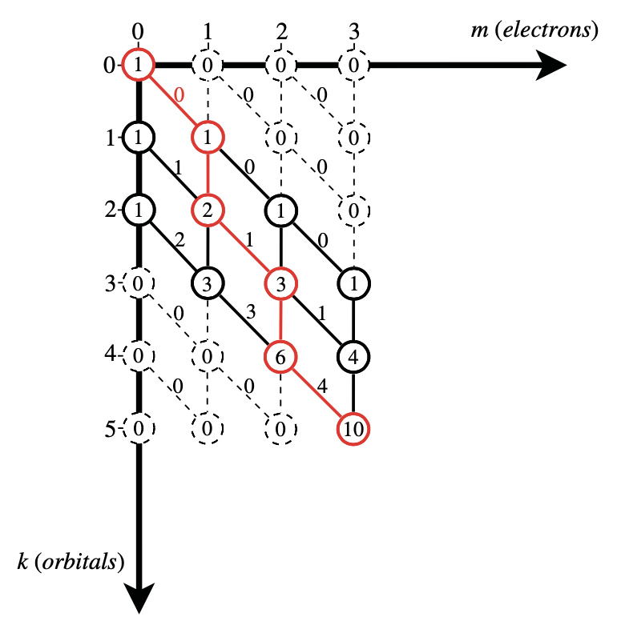

.. only:: html

    .. math::
        \renewenvironment{equation*}
        {\begin{equation}\begin{aligned}}
        {\end{aligned}\end{equation}}
        \renewcommand{\gg}{>\!\!>}
        \renewcommand{\ll}{<\!\!<}
        \newcommand{\I}{\mathrm{i}}
        \newcommand{\D}{\mathrm{d}}
        \renewcommand{\C}{\mathrm{C}}
        \newcommand{\dt}{\frac{\D}{\D t}}
        \newcommand{\E}{\mathrm{e}}
        \renewcommand{\bm}{\boldsymbol}

.. note::
    [QCDES] Gonzalez, L., & Lindh, R. (Eds.). (2021). Quantum Chemistry and Dynamics of Excited States: Methods and Applications. John Wiley & Sons.

第六章 多组态量子化学基础
=========================

摘要
----

介绍了解决薛定谔方程及其与量子化学相关问题的基本目标后，本文描述了基本的多组态方法来解决这些问题。由于即使在有限的基组中，精确的（或完全组态相互作用）解决方案也会带来指数级的计算成本，因此讨论了在斯拉特行列式或组态函数基础上的有效表示的重要性。借助这种有效的表示，可以应用迭代技术（如Davidson方法）来获得描述量子化学系统的哈密顿量的最重要的低能本征态的精确解。由于指数级的计算成本仍然限制了这些直接方法的系统规模，因此本文深入讨论了自洽场方法的多组态扩展（MCSCF），该方法捕捉了问题的静态相关性，并作为许多更复杂技术的起点。此外，本文介绍了完全活性空间方法（CAS）及其推广和限制版本，它允许直观地构建化学上重要的参考空间，并在处理问题的重要自由度时实现更紧凑的描述。我们解释了在MCSCF方法中获得激发态的态特定和态平均方法，并通过介绍随机蒙特卡罗方法来解决前所未有的活性空间尺寸的FCI问题来结束本章。

绪论
----

在量子力学层面描述化学系统时，电子性质是由一个 :math:`N` 电子波函数 :math:`\Psi` 推导出来的，这是一个关于所有电子的位置和自旋的复值函数，完全捕捉了系统的稳态及其性质（如能量 :math:`E` ）。电子波函数 :math:`\Psi` 是通过求解非相对论静态薛定谔方程来确定的。

.. math::
    \hat{H} \Psi = E \Psi,
    :label: eq61

其中，:math:`\hat{H}` 是描述系统的哈密顿算符。系统的性质是通过对合适算符在波函数 :math:`\Psi` 的期望值得到的。精确求解薛定谔方程极为困难，而且只有在少数特殊情况下才能获得精确解。

尽管定态薛定谔方程是在实空间中形成的，而 :math:`N` 电子波函数 :math:`\Psi` 是 :math:`3N` 个空间变量和自旋的连续函数，但许多方法依赖于对波函数的离散化处理，其中原子轨道 (AO) 表示单粒子基，而斯莱特行列式(SD) 则表示 :math:`N` 电子基。在现代方法中，对波函数的离散化处理始于选择有限的 AO 列表，这样会引入不可避免的基组截断误差。从 AO 基础上获得分子轨道，使用一个或多个 SD 构建 :math:`N` 电子波函数 :math:`|\Psi\rangle`。离散化的波函数采用以下简单形式：

.. math::
    |\Psi\rangle = \sum_i C_i |i\rangle,
    :label: eq62

其中 :math:`|i\rangle = |\chi_{i_1\sigma_1} \cdots \chi_{i_n\sigma_n} \rangle` 是 SD 被用作 :math:`N` 电子基，:math:`C_i` 是相应的系数。为方便起见，从现在开始使用简短的符号 :math:`|i\rangle` 代替完整的展开式表示 SD。向量 :math:`\mathbf{C} = \{ C_i \}` 称为组态相互作用 (CI) 向量，获得基态的 CI 向量等价于在给定的 :math:`N` 电子基上为最低特征值求解薛定谔方程。

将连续函数 :math:`\Psi` 用式 :eq:`eq62` 的有限 :math:`N` 电子展开来替换，薛定谔方程可以重构成一个线性代数问题。从式 :eq:`eq61` 开始，左乘 :math:`\langle j|` ，可以得到：

.. math::
    \sum_i \langle j|\hat{H}| i\rangle C_i = E \sum_i \langle j | i \rangle C_i
    :label: eq63

通过使用一个正交基组，即 :math:`\langle i | j \rangle = \delta_{ij}`，可以将式 :eq:`eq63` 简化为

.. math::
    \sum_i \langle j|\hat{H}| i\rangle C_i = E C_j.
    :label: eq64

不同的选择 :math:`N`-电子基组 (选择多少个和哪些 Slater 行列式) 会导致不同层次和风味的量子化学方法，通过合理选择基组可以获得对多体波函数的准确描述，同时具有令人瞩目的优点，即之前的偏微分方程的薛定谔方程现在成为一个有限维的本征值问题。

可能的方法来解决方程 :eq:`eq64` 的本征值问题将在第 6.4 节中讨论。基于 SD 的多电子波函数的展开具有极其简单的评估非零 :math:`\langle j|\hat{H}|i\rangle` 项的优点（参见第6.2.1节）。然而，Slater 行列式通常不是总自旋算符 :math:`\hat{\mathbf{S}}^2` 的本征函数，从而在许多情况下，CI 本征值问题的解不是 :math:`\hat{\mathbf{S}}^2` 的特征向量（自旋污染），使得用自旋来描述分子系统变得不可能。为了避免这种限制，波函数的离散化可以基于自旋适应函数，也称为组态状态函数（CSF）。CSF 可以构造为 SD 的特定线性组合，具有特定的总自旋。有关 CSF 的构造和耦合将在第 6.3 节中详细讨论。

只有不断增大的单电子基组合使用逼近完全组态相互作用极限的更精细的方法，才能得到给定非相对论薛定谔方程的精确解，如图 6.1 所示。然而，对于实际感兴趣的化学系统，对于给定的单电子基组，:math:`N`-电子函数 :math:`|i\rangle` 的数量很快变得难以处理。

在简单的 Hartree-Fock (HF) 方法中，对于所选择的单电子基组，MO 在一个单个 SD 产生的场中进行变分优化，该 SD 称为 HF 行列式。我们将其称为单构型方法。Hartree-Fock 波函数相对于占据-占据和虚拟-虚拟轨道旋转是不变的。 [因为它们各自具有相同的 PDM 特征值 0 或 2. 属于同一特征值的特征向量是简并的, 可以任意线性组合. 但是这些特征向量对应的哈密顿量的轨道能量本征值确是不一样的, 因此可以选择那些可以对角化 Fock 算符的轨道作为正则轨道.] 然而，任何占据-虚拟轨道混合都会使 HF 波函数偏离其变分极小值。[这里是说不能混合占据-虚拟轨道, 因为它们特征值不同. ] 可以扩大行列式展开式 [指采用多个行列式, 但是都是基于同一 HF 轨道或 MO 选择]，并在保持 HF 轨道（或任何其他适当的 MO 选择）不变的情况下优化 CI 展开系数 :math:`C_i` 。这种方法是组态相互作用（CI）方法的核心，在 6.4.1 节中详细讨论。使用由一个参考构型（通常是 HF 行列式）产生的所有单重和双重激发的空间称为单重和双重激发的组态相互作用（CISD）。该方法相对于轨道旋转也具有与 HF 相同的不变性。[指占据空间之内, 或者虚拟空间之内的旋转不会改变结果]

在选择一个选定的有限区域内的一定数量的活性电子 :math:`N`（即 Fermi 面（前线轨道）周围的一组活性轨道 :math:`n` ）进行激发，并且在遵守空间和自旋对称性约束的前提下，以所有可能的方式生成行列式展开，可以得到完全活性空间组态相互作用（CASCI）波函数。还有其他一些选项，其中一些将在第 6.6 节中讨论。在多组态自洽场（MCSCF）方法中，同时对展开系数和 MO 进行变分优化。与 Hartree-Fock 方法不同，在 MCSCF 中，MO是在多组态波函数生成的平均场下进行优化的。[而 HF 是在单组态的情况下优化. ] MCSCF波函数的参数化及其优化将在第 6.5 节中详细讨论。常用的 MCSCF 方法是完全活性空间自洽场（CASSCF）方法，其中 CI 展开在合适的活性空间中以完全 CI 的形式得到。

CASSCF 方法的主要缺点是，CAS 波函数随着活性空间的大小呈指数增长，对于实际模拟，目前计算上的限制在大约 18 个电子和 18 个轨道的活性空间，即 CAS(18,18)。为了部分规避指数尺度，可以采用截断波函数的方法。已经成功应用了各种形式的 CAS 波函数截断，例如限制活性空间（RAS）和广义活性空间（GAS）波函数，导致了 RASSCF 和 GASSCF 方法。RAS 和 GAS 波函数将在第 6.6 节中进行讨论，重点介绍它们如何在量子化学的各个领域中构建和应用。

近年来，已经开发了一些可替代的方法来应对 CASSCF 计算中的指数级扩展，其中密度矩阵重整化群（DMRG-SCF）方法和随机 CASSCF 是有前途的例子。随机 CASSCF 方法是基于 FCI 量子蒙特卡罗方法（FCIQMC）作为 CI 本征求解器的。DMRG 方法在第七章中讨论，而 FCIQMC 和随机 CASSCF 将在第 6.8 节中讨论。

第一节 FCI、CAS 和 RAS 波函数中的缩放问题
----------------------------------------

FCI 和 CAS 方法的主要缺点是它们与相关轨道和电子数呈指数级增长，因此，即使对于较小的活性空间，考虑的希尔伯特空间的大小也可能会非常大。

考虑在 :math:`n` 个轨道中分布 :math:`N` 个电子，并且没有施加空间对称约束时，通过考虑所有可能的分布来生成所有 Slater 行列式的数量 :math:`N_{SD}` 由以下公式给出：

.. math::
    N_{SD}(N, n, M_s) = \begin{pmatrix} n \\ \frac{N}{2} + M_s \end{pmatrix}
    \begin{pmatrix} n \\ \frac{N}{2} - M_s \end{pmatrix}

[每个轨道 alpha 占据和 beta 占据是独立的, 因此相当于在这 :math:`n` 个轨道里面按二项式系数选择 nalpha 个轨道占据, 然后独立选择 nbeta 个轨道占据. ]

当用 :math:`\alpha` 和 :math:`\beta` 电子表示时，这个方程可以写成：

.. math::
    N_{SD}(N, n, M_s) = \begin{pmatrix} n \\ N_{\alpha} \end{pmatrix}
    \begin{pmatrix} n \\ N_{\beta} \end{pmatrix}
    :label: eq66

因为 :math:`N = N_\alpha + N_\beta` 而 :math:`M_s = (N_\alpha - N_\beta) / 2`.

在表 6.1 中列出了一系列完全活性空间（CAS）大小（CAS(N,n)）， N = n 和 S = Ms = 0 的 Slater 行列式数量以及存储相应 CI 向量所需的内存，表明在多组态方法中可以显式关联的电子和轨道的数量受到严格的技术限制。即使是额外的对称性约束，如点群对称性，也只能将波函数的大小减少一个数量级，因此可访问的系统大小不能显著增加。 ::

    >>> import block2 as b
    >>> for i in [8, 12, 16, 20, 24]:
    ...     x = c.combination(i, i // 2) ** 2
    ...     print(i, x, Parsing.to_size_string(8 * x))
    ... 
    8 4900 38.3 KB
    12 853776 6.51 MB
    16 165636900 1.23 GB
    20 34134779536 254 GB
    24 7312459672336 53.2 TB

Slater 行列式不是总自旋算符 :math:`\hat{S}^2` 的本征函数，式 :eq:`eq66` 表示自旋本征函数的数量的上限。[因为不是本征函数, 所以是上限. 本征函数是行列式可以表示的函数的一个子集. 如果行列式是本征函数, 那么两者数量就是一样, 而不是上限. ] 第一章中的非相对论哈密顿量 :math:`\hat{H}`（式（1.18））是自旋无关的，因此，具有给定总自旋量子数 :math:`S` 的所有状态都是简并的，[这里简并的意思是相对于哈密顿量的, 即它们能量一样] 而和其 :math:`M_s` 本征值无关。因此，只需考虑每个 :math:`S` 值的一个状态，即可减小目标空间的大小。具有特定总自旋量子数 :math:`S = M_s` 的自旋适应电子组态（称为组态状态函数，CSFs）的数量是通过从式 :eq:`eq66` 中去除自旋更高的行列式获得的。

.. math::
    N_{CSF}(N, n, S) = N_{SD}(n, N_\alpha, N_\beta)
        - N_{SD}(n, N_\alpha + 1, N_\beta - 1)

[当考虑行列式的 S 和 M 的时候, S 小于等于 open 的数目, M 对应于 up 和 down 的差.
对于 open = 2, uu ud du dd. ud du 可以通过线性组合得到 S = 0 和 S = 1, dd 和 uu 必须是 S = 1]

[对于上式的理解, 首先注意假定了 :math:`M = S`, 由于 :math:`S` 非负, :math:`M` 必须也是非负.
这意味着 :math:`2M = N_\alpha - N_\beta \geq 0`, 因此 :math:`N_\alpha \geq N_\beta`.
然后, :math:`N_{SD}(n, N_\alpha, N_\beta)` 代表 :math:`2M = N_\alpha - N_\beta` 的所有行列式, 这些行列式可以展开对于给定的 :math:`n, M` 和 :math:`N`, :math:`2S \geq N_\alpha - N_\beta` 的所有 CSF. 但是等式左边我们需要对于给定的 :math:`n, M, S` 和 :math:`N` 的 CSF 数目. 问题的关键是把 :math:`S` 的可能性缩小. 注意到 :math:`N_{SD}(n, N_\alpha + 1, N_\beta - 1)` 代表的 :math:`N` 和 :math:`n` 和之前一样, :math:`2S \geq N_\alpha + 1 - (N_\beta - 1) = N_\alpha - N_\beta + 2`, 因此 :math:`2S` 的范围刚好比之前缩小了一点. 但是这里 :math:`M` 变了. 但是我们注意到对于所有这些 :math:`S`, 对不同的 :math:`M` 的数目是一样的, 所以可以更改 :math:`M` (在讨论行列式的数目, 但是固定了 :math:`S` 之后, 实际上就和 CSF 的数目是一样的)]

[举个例子, 考虑 3 个电子, 3 个 open 轨道, 一共有 :math:`2^3 = 8` 种情况. 我们要求 :math:`2S = 1` 的情况. 既然我们约定 :math:`M=S`, 我们看这些 :math:`2M = 1` 的没有适配 :math:`S` 的行列式, 有 :math:`uud, udu, duu` 三个. 但这些行列式既可以是 :math:`2S = 1`, 也可以是 :math:`2S = 3`. 因此我们考虑 :math:`N_\alpha = 3, N_\beta = 0`, 这只有 :math:`uuu` 一个. 这个对应于 :math:`2S = 3, 2M = 3` 只有一个行列式. (一组固定 M 的行列式的数目, 和它能表示的所有不同 S 的 CSF 数目是一样的.) 但我们知道 :math:`2S = 3, 2M = 3` 的 CSF 数目和 :math:`2S = 3, 2M = 1` 或者任意 :math:`2M` 的 CSF 数目是一样的, 所以我们可以推断, 我们应该从 :math:`uud, udu, duu` 中减去这一个对应于 :math:`2S = 3, 2M = 1` 的那个, 得到 :math:`2S = 1, 2M = 1` 的 CSF 数等于 3 - 1 = 2. 或者直接用 +- 标记, 注意必须先 + 才能 -, 因此只有 :math:`++-, +-+` 两种.]

Weyl-Paldus 维数公式也可用于计算总的自旋自适应函数的数量。

.. math::
    N_{CSF}(N, n, S) = \frac{2S + 1}{n + 1}
    \begin{pmatrix} n + 1 \\ \frac{N}{2} - S \end{pmatrix}
    \begin{pmatrix} n + 1 \\ n - \frac{N}{2} - S \end{pmatrix}

[注意 :math:`n + 1 - (n - \frac{N}{2} - S) = \frac{N}{2} + S + 1`. 具体推导可以参考自旋适配密度矩阵重整化群那里的注解.]

注意以上两式是等价的.

一系列完整活性空间大小为 CAS(N,n) 的行列式数和组态状态函数在图 6.2 中也有所报道。灰色区域表示计算需要大量的计算资源和专用大内存计算机。超出灰色区域，目前计算技术上是不可能的。如果使用斯特林公式的话，n! 〜 2𝜋n，行列式数和组态状态函数的总数的方程可以近似地用下式表示 (其中N=n)：

.. math::
    N_{SD} \approx \frac{2}{\pi n} 4^n \\
    N_{CSF} \approx \left( 1 - \left(\frac{n}{n+2}\right)^2 \right) \frac{2}{\pi n} 4^n.

以上两式清楚地表明，Slater 行列式和组态态函数的数量随着有关轨道的数量呈指数增长。Slater 行列式和组态态函数数量的增长，用斯特林公式近似表示，用实线在图 6.2 中表示。指数增长也可以通过更为定性的论证得到证明，即考虑将 n 个轨道用电子填充的可能性的数量等于 :math:`4^n`，因为每个轨道可以是双占据、只用一个 :math:`\alpha` 电子或一个 :math:`\beta` 电子占据，或者不被占据，而这些选项与其他轨道的占据情况是独立的。这样就可以生成n个轨道中任意电子数的所有可能组态，但是与固定电子数的情况相比，其规模的变化趋势是相同的。不建议使用 "阶乘级别" 的术语来指代二项式系数，因为这会暗示其增长速度比以上所示的 :math:`4^n` 增长速度更快。

第二节 斯莱特行列式的耦合和分解
-------------------------------

FCI 和 CASCI 波函数的指数级增长很快使得密集矩阵操作变得难以承受。迭代方法（见第6.4.1节），例如 Davidson 方法[1，2]，已被推荐以避免对大型哈密顿矩阵进行完全对角化。这些方法需要存储 :math:`\sigma` 向量，:math:`\sigma = HC`，而不是完整的哈密顿矩阵。为了使缩并到 :math:`\sigma` 向量可以实践，其计算必须高效地进行。用于有效计算 sigma 向量的方法已被Siegbahn [3]、Knowles 和 Handy [4] 报告。

在本节中，我们将讨论 Handy 的技术[5]，即将 Slater 行列式分离为 :math:`\alpha` 字符串和 :math:`\beta` 字符串，这是行列式 CI 技术的重要里程碑。这个过程用于按照规定顺序生成行列式，并以计算上的优势方式计算密度矩阵或 sigma 向量的贡献。当讨论直接CI算法 [6, 7] 时，这种方法的优势将更加明显。

根据 Handy 的方法，一个 Slater 行列式可以分解如下：

.. math::
    |\alpha(I_\alpha)\beta(I_\beta)\rangle
        = \hat{\alpha} (I_\alpha) \hat{\beta} (I_\beta) |vac\rangle.

:math:`\alpha` -串，:math:`\hat{\alpha}(I_\alpha)` ，和 :math:`\beta` -串， :math:`\hat{\beta}(I_\beta)` ，分别是由 :math:`N_\alpha` 个和 :math:`N_\beta` 个产生算符的乘积构成，用于 :math:`\alpha` 自旋轨道和 :math:`\beta` 自旋轨道，串的维度是一个常数，由给定系统的电子总数 :math:`N` 和自旋投影 :math:`M_s`（总自旋的z分量）定义。

.. math::
    N_\alpha = (N + 2M_s) / 2 \\
    N_\beta  = (N - 2M_s) / 2.

:math:`\alpha`-和 :math:`\beta`-字符串的数量是通过二项式系数获得的

.. math::
    N_{strings}^\alpha = \begin{pmatrix} n \\ N_\alpha \end{pmatrix} \\
    N_{strings}^\beta  = \begin{pmatrix} n \\ N_\beta  \end{pmatrix}

其中 :math:`N_\alpha`（或 :math:`N_\beta` ）个电子分布在 :math:`n` 个轨道中，它们的乘积给出了 Slater 行列式的总数

.. math::
    N_{det} = \begin{pmatrix} n \\ N_\alpha \end{pmatrix}
    \begin{pmatrix} n \\ N_\beta  \end{pmatrix}

正如在前一节中已经看到的那样. 字符串的因式分解允许以矩阵形式读取、处理和存储 Slater 行列式。该方法使得仅作用于 :math:`\alpha`（或 :math:`\beta`）电子的算符的计算变得高效。同样地，CI 向量和 sigma 向量可以被向量化并以矩阵形式存储。

字符串的图形表示用于对字符串进行排序。字符串的排序是有利的，因为字符串在字符串列表中的位置提供了有关电子在轨道中分布的信息。我们考虑在 n 个轨道中有 N 个 :math:`\alpha` 电子的情况。每个字符串可以表示为一个 :math:`n \times N` 图中的路径，该图是通过在顶点（k，m）之间绘制弧线而获得的，其中 k 是轨道索引，m 是直到轨道 k 中的电子数（见图 6.3）。所有路径都从（0,0）开始，以（n，N）结束。路径上的垂直弧线从顶点（k，m）到（k + 1，m）意味着轨道（k + 1）未被占据。从顶点（k，m）到（k + 1，m + 1）的对角线弧线表示轨道（k + 1）被占据。例如，3个电子在5个轨道中的 :math:`\alpha` 字符串，可以写成一个向量

.. math::
    \hat{a}_{1\alpha}^\dagger
    \hat{a}_{3\alpha}^\dagger
    \hat{a}_{5\alpha}^\dagger |vac\rangle
    = \begin{pmatrix} k & m \\ 1 & 1 \\ 
    2 & 1 \\  3 & 2 \\ 4 & 2 \\ 5 & 3 \\ \end{pmatrix}

该路径可以在图 6.3 中进行图形表示。

**图6.3.** 路径描述了字符串 :math:`\hat{a}_{1\alpha}^\dagger \hat{a}_{3\alpha}^\dagger \hat{a}_{5\alpha}^\dagger |vac\rangle`（以红色表示）。路径包含三个对角线弧（占据的轨道）和两个竖直弧（未占据的轨道）。

字符串按照逆字典序排序 [并不是把字典序倒序, 而是把字符串倒序, 然后按字典序]，即如果在最后一个不同的占据位上，字符串X的轨道编号较低，则字符串X在字符串Y之前。例如，在5个轨道中分配3个 :math:`\alpha` 电子， :math:`\alpha` -字符串 :math:`124` 在 :math:`\alpha`-字符串 :math:`135` 之前。为了从字符串的图形表示中获得逆字典序排序，对每个允许的顶点（如果至少被一个路径访问，则称为允许的顶点）关联一个顶点权重 :math:`W_{k,m}`，等于从（0，0）到（k，m）的不同路径数。由于所有这些路径必须来自（k−1，m−1）或（k−1，m），因此可以得出以下顶点权重之间的递归关系式

.. math::
    W_{k,m} = W_{k-1,m} + W_{k-1,m-1}

这个方程清楚地表明每个顶点的权重等于右上角和左上角的顶点权重之和。 起始顶点（0,0）的权重为1（:math:`W_{0,0}=1`）。禁止的顶点权重设置为零。所有其他顶点权重均根据公式（6.18）计算。 我们还使用以下递归关系引入弧权重

.. math::
    Y_{k+1,m+1} = W_{k+1,m+1} - W_{k,m} = W_{k,m+1}

它等于位于弧的右上方的顶点权重。垂直弧的弧权重为零。然后，路径权重是沿考虑的路径的弧权重之和。对于图6.3中给出的示例，我们发现路径权重为 :math:`I_\alpha = 5` 。路径权重代表逆字典序排序行列式的索引编号。有了路径权重，任何字符串列表都可以按逆字典序排序并写入。具有较低路径权重的 :math:`\alpha`-和 :math:`\beta`-字符串在有序字符串列表中出现较早。有关此主题的更多细节，请参考文献[7，8]。

[这个如何理解? 和不同行表的道理一样, 竖着的是轨道. 这里只有两个分支.
所以 GHF 的不同行表就是 alpha beta 分开的 string 方法.]

6.2.1 斯莱特-康顿规则
^^^^^^^^^^^^^^^^^^^^^

一种评估哈密顿矩阵元素的高效方法

.. math::
    H_{ij} = \langle D_i | \hat{H} | D_j \rangle

在量子化学应用中，有效地评估 Slater 行列式之间的哈密顿矩阵元是至关重要的。由于电子哈密顿量最多包含二体相互作用，任何两个差距超过四个自旋轨道的行列式 :math:`|D_i\rangle` 和 :math:`|D_j\rangle` 之间的矩阵元都将为零。

首先，假设 :math:`|D_i\rangle` 和 :math:`|D_j\rangle` 正好相差四个自旋轨道，即在 :math:`|D_i\rangle` 中占据的两个自旋轨道 R, S [大写字母表示自旋轨道的组合的空间和自旋坐标.] 在 :math:`|D_j\rangle` 中没有被占据，在 :math:`|D_j\rangle` 中占据的两个轨道 P、Q 在 :math:`|D_i\rangle` 中没有被占据，而所有其他自旋轨道在 :math:`|D_i\rangle` 和 :math:`|D_j\rangle` 中的占据数相同。我们称 :math:`|D_j\rangle` 是 :math:`|D_i\rangle` 的双激发，然后可以将其写为：

.. math::
    |D_j\rangle = \hat{a}_P^\dagger \hat{a}_Q^\dagger \hat{a}_R \hat{a}_S |D_i\rangle.
    :label: eq21

将第1章中的 Hamiltonian 算符的表达式（式（1.18））插入到元素 :math:`\langle D_j | \hat{H} | D_i \rangle`中，并考虑到不涉及双激发 :math:`\hat{a}_P^\dagger \hat{a}_Q^\dagger \hat{a}_R \hat{a}_S` 的所有项均为零，得到：

.. math::
    H_{ij} =&\ \frac{1}{2} \big(
        (pr|qs) \langle D_j | \hat{E}_{pr} \hat{E}_{qs} |D_i \rangle
        +  (qs|pr) \langle D_j | \hat{E}_{qs} \hat{E}_{pr} |D_i \rangle
        +  (ps|qr) \langle D_j | \hat{E}_{ps} \hat{E}_{qr} |D_i \rangle
        +  (qr|ps) \langle D_j | \hat{E}_{qr} \hat{E}_{ps} |D_i \rangle
        \big) \\
        =&\ (pr|qs) - (ps|qr)
    :label: eq22

[我们后面倾向于不用斯莱特-康顿规则, 而采用更一般的方法计算任意二次量子化哈密顿量的矩阵元. 因此忽略这里的推导. 注意上面 Hamiltonian 的定义如下. 这里意味着 pqrs 在自旋轨道的意义上互相完全不一样.]

.. math::
    \hat{H} = \sum_{pq} \hat{E}pq h_{pq}
    + \frac{1}{2} \sum_{pqrs} \hat{e}_{pqrs} (pq|rs)

因此，在双激发的情况下，矩阵元只取决于激发算符，而与其余轨道无关。对于单重激发

.. math::
    |D_j\rangle = \hat{a}_P^\dagger \hat{a}_R |D_i\rangle,
    :label: eq23

我们得到下列表达式 [这里虽然取决于其他轨道, 但是这些轨道也是 Hamiltonian 里面的, 因此不影响我对一般 Hamiltonian 方法的理解, 即 integral driven 的方法.]

.. math::
    H_{ij} =&\ h_{pr} \langle D_j |\hat{E}_{pr} | D_i \rangle
    +\frac{1}{2} \sum_k \big(
        (pr|kk) \langle D_j | \hat{E}_{pr} \hat{E}_{kk} | D_i \rangle
      + (kk|pr) \langle D_j | \hat{E}_{kk} \hat{E}_{pr} | D_i \rangle
      + (pk|kr) \langle D_j | \hat{E}_{pk} \hat{E}_{kr} - \hat{E}_{pr} |D_i\rangle
      + (kr|pk) \langle D_j | \hat{E}_{kr} \hat{E}_{pk} - \hat{E}_{pr} |D_i\rangle
        \big) \\
    =&\ h_{pr} + \sum_k \big[ (pr|kk) - (pk|kr) \big]
        \langle D_i | \hat{n}_k | D_i \rangle,
    :label: eq24

[当然 Hamiltonian driven 的算法可能也有问题, 就是对单激发行列式, 行列式的数量比实际要低. 所以可能在积分重排序之后, 按照可能涉及的激发类型进行分类? 然后每一类即使只有一个, 选出那一个应该并不需要枚举.]

其中 :math:`\hat{n}_k = \hat{a}_k^\dagger \hat{a}_k` 是空间轨道 :math:`k` 的占据数算符，限制了求和范围为占据轨道。与双激发相比，矩阵元现在取决于哪些轨道被占据。

对于对角矩阵元 :math:`H_{ii}` ，不会产生由激发算符引起的改变自旋轨道占据情况的贡献, 从而

.. math::
    H_{ii} =&\ \sum_k h_{kk} \langle D_i |\hat{E}_{kk} |D_i\rangle
        + \frac{1}{2} \sum_{kl} \big(
      (kk|ll) \langle D_i | \hat{E}_{kk} \hat{E}_{ll} | D_i \rangle
    + (ll|kk) \langle D_i | \hat{E}_{ll} \hat{E}_{kk} | D_i \rangle
    + 2(kl|lk) \langle D_i | \hat{E}_{kl} \hat{E}_{kl} - \hat{E}_{kl} | D_i\rangle
    \big) \\
    =&\ \sum_k h_{kk} \langle D_i | \hat{n}_k | D_i \rangle
    + \sum_{kl} \big[ (kk|ll) - (kl|lk) \big]
        \langle D_i | \hat{n}_k \hat{n}_l | D_i \rangle
    :label: eq25

我们再一次看到，占据数算符的期望值限制了空间轨道的求和范围。

式 :eq:`eq22` 到 :eq:`eq25` 称为 Slater-Condon 规则，将 :math:`N` 电子问题的哈密顿矩阵元的计算简化为一、二体积分的计算。计算矩阵元的计算成本仅与占据轨道数量成线性比例，并且与所涉及的行列式的虚轨道数无关。

最后，将 :math:`|D_j\rangle` 的表达式表示为 :eq:`eq21` 或 :eq:`eq23` 中的形式是应用 Slater-Condon 规则的关键。但是，式 :eq:`eq21` 中的产生/湮灭算符的顺序不固定，即 :math:`a_P^{\dagger} a_Q^\dagger a_S a_R` 的不同顺序可能会引入符号变化。

