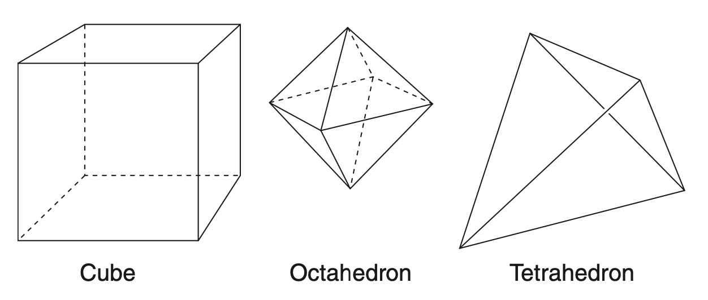
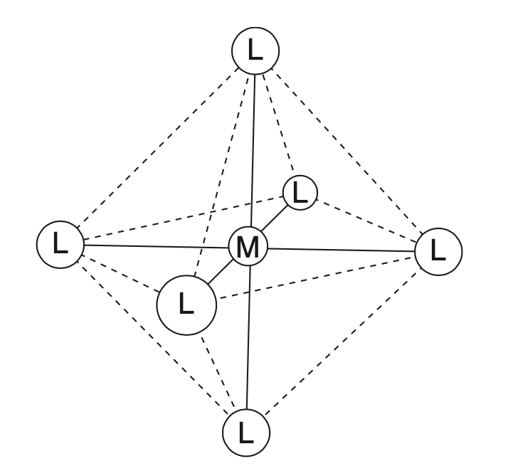
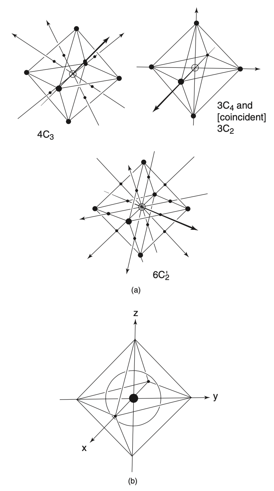
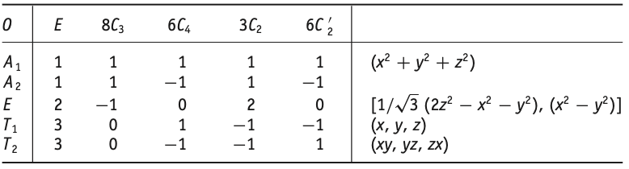
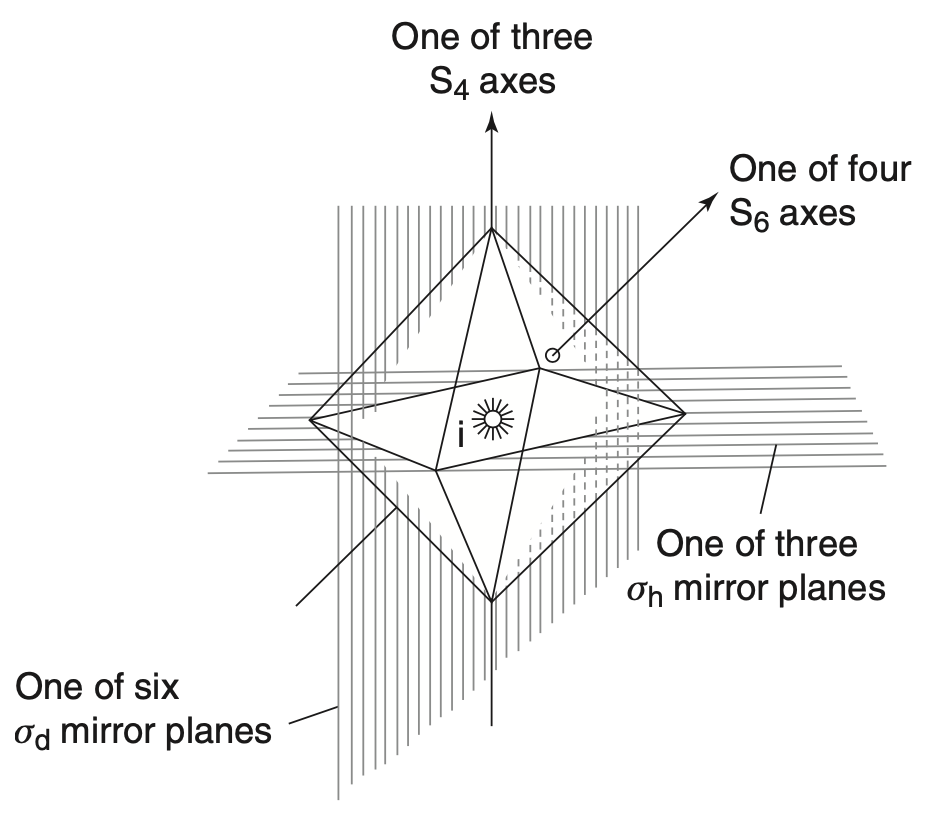
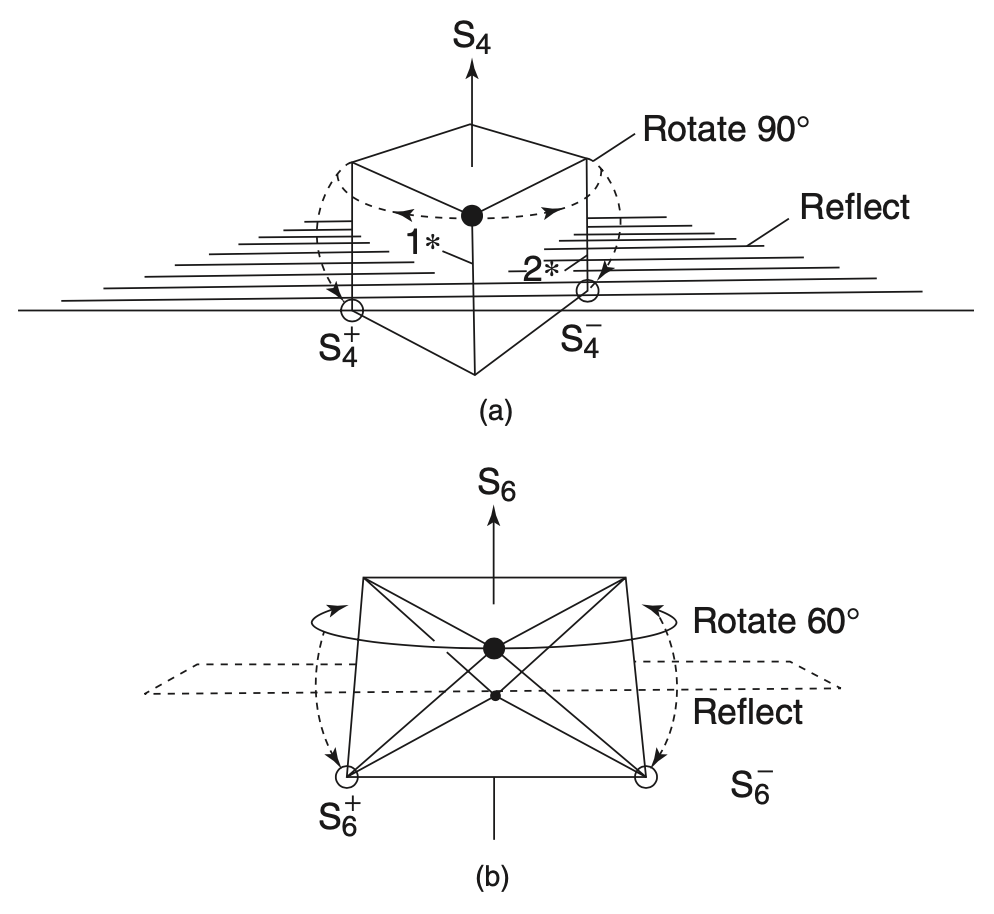
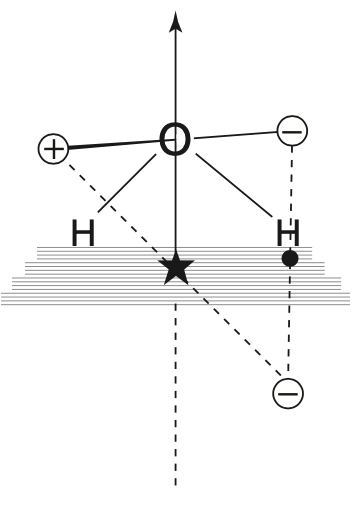
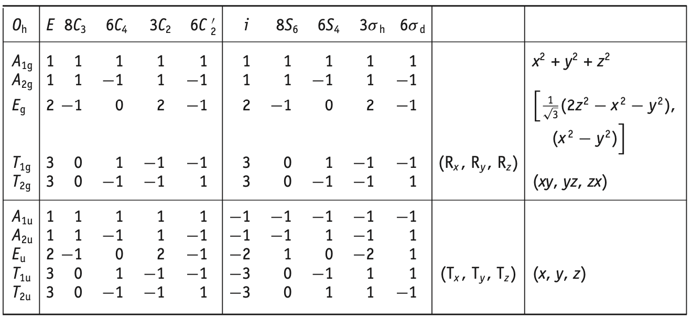

.. only:: html

    .. math::
        \renewenvironment{equation*}
        {\begin{equation}\begin{aligned}}
        {\end{aligned}\end{equation}}
        \renewcommand{\gg}{>\!\!>}
        \renewcommand{\ll}{<\!\!<}
        \newcommand{\I}{\mathrm{i}}
        \newcommand{\D}{\mathrm{d}}
        \renewcommand{\C}{\mathrm{C}}
        \newcommand{\dt}{\frac{\D}{\D t}}
        \newcommand{\E}{\mathrm{e}}
        \newcommand{\xtensor}[3]{{#1}#2 {\vphantom{#1}}#3}
        \renewcommand{\bm}{\boldsymbol}

.. note::
    Sidney F. A. Kettle. Symmetry and Structure: Readable Group Theory for Chemists, 2007 John Wiley & Sons, Inc.

对称性和结构 (Kettle)
============================

第八章 一些八面体分子的电子结构
--------------------------------------

本章将充分利用本书迄今为止开发的方法，其中将详细考虑八面体分子 SF6 的电子结构
然后将结果扩展到过渡金属配合物。 SF6 是一个相当大的分子，但它的对称性也相当可观；
足以让我们不仅考虑硫和氟之间的成键，而且还考虑氟上的非成键电子。
有一些捷径可用于对称性讨论，目前的方法是能够引入其中的几个。本书的每一章都遇到了新的对称运算。本章也是如此；这些操作将完成点群中遇到的类型，因此下一章将对点群分类进行一般回顾。这将为第 10 章做准备，在第 10 章中将详细介绍点群和球对称之间的关系。

图 8.1 显示了一个立方体、一个八面体和一个四面体。八面体与立方体密切相关。如果立方体的面的中点连接在一起，则生成的图形是八面体。八面体有八个面，但更重要的是它有六个顶点，因为当这些顶点被图形中心的一个原子周围的六个原子占据时，就会产生一个八面体分子（图 8.2）。在大多数八面体 ML6 化合物中，中心原子是金属离子，而周围的原子或离子通常是带负电元素的原子或离子，称为配体。这些物种被称为 "八面体复合物"。尽管以此类分子开始讨论并不方便，但本章稍后将对其进行更详细的介绍。

   图 8.1

四面体（图 8.1）也源自立方体，正如在第 1 章中所认识到的（参见图 1.4 和第 1.2.4 节中的讨论）。 八面体和四面体都与立方体有关的事实意味着可以共同讨论八面体和四面体过渡金属配合物的电子结构。 在本书中，虽然会指出起点，但我们不会开始讨论。 四面体群将在第 10 章更详细地讨论。然而，首先看一下八面体的对称性。

   图 8.2 八面体分子 ML6. 这个名字来源于它有八个面.

8.1 八面体的对称运算
^^^^^^^^^^^^^^^^^^^^^^^^^^^

在图 8.3a 中显示了那些将八面体 ML6 分子变成自身的纯旋转对称操作（也有其他操作，但从旋转开始比较方便）。
八面体包含三个四重旋转轴，并且必须包含三个重合的双重旋转轴[四重旋转也是双重旋转]。
还有六个双轴与与四重旋转轴截然不同。
最后，有四个三重旋转轴。[注意这里的顺序和图中出现的顺序不一样. 四重旋转是沿连接每一对配体原子或者直接就是 XYZ 坐标轴, 因此是3个.
六个双轴是连接一对边, 是带撇的. 四个三重旋转是连接一对面的中心. 每个面是三角形面, 因此是三重旋转. 一共八个面, 因此有4对]
毫不奇怪，图 8.3a 显示了一组相当令人眼花缭乱的对称轴，但有一种降低复杂性的简单方法。这是通过将对称元素与几何特征相关联。因此，每个 C3 轴都通过八面体相对两侧的一对等边三角形面的中点。有八个面，所以有四对相对的面。因此有四个不同的 C3 轴。类似地，C4 和重合的 C2 轴穿过相反的顶点对；有六个顶点，所以只有三个 C4 和 C2。另一个轴 C2' 穿过一对相对的边的中点。因为八面体有十二条边，所以有六个 C2' 轴。与每组轴相关联的操作形成单独的类这一事实从旋转轴与组中的其他操作互换的方式（例如，C3 操作互换 C4 轴）的方式实际上是显而易见的。

   图 8.3 (a) 八面体的旋转对称元素，为了清楚起见，分为三个图。 (b) 八面体坐标轴的常规选择.

[总之, 这里是4C3, 3C4, 3C2, 6C2']

对于 C3 和 C4 旋转轴中的每一个，都有两个不同的对称操作——顺时针旋转和逆时针旋转。 这些轴和操作已在前两章中遇到。 因此，将 ML6 分子变成自身的旋转对称操作是
E、8C3、6C4、3C2 和 6C2'
其中包括恒等运算并且 6C2' 是指那些穿过八面体对边对的双轴。 这组24个运算构成点群O。它是一个完整群的事实可以通过构造群乘法表来表示。

群 O 的特征标表可以使用第 5 章中遇到的定理推导出来（尽管任务不是一个简单的任务），并在表 8.1 中给出。

   表 8.1

表 8.1 有几个方面需要评论。 第一次遇到三重简并的不可约表示； 它们被标记为 T（带有各种后缀）。 它们的存在在本章早些时候被暗示，当时评论 "八面体分子具有彼此等效的 x、y 和 z 轴"。 这些轴为可约或不可约表示提供了基础。 在这种情况下，它是不可约的，并且如表 8.1 右侧给出的基函数所示，它们实际上构成了 T1 不可约表示的基。

表 8.1 的右侧显示了比以前遇到的更多的基函数。原因是本章后面对过渡金属配合物的讨论将需要了解八面体中心过渡金属的 d 轨道如何变换。表 8.1 表明 d 轨道 dxy、dyz 和 dzx 简并, 并按照 T2 变换，
而 dz2（或更准确地说， :math:`d_{(1/\sqrt{3})(2z^2-x^2-y^2)}`) 和 :math:`d_{x^2 - y^2}` 简并, 并按照 E 变换。
函数 :math:`x^2+y^2+z^2` 与 s 轨道类似，具有球对称按照 A1 变换。

从图 8.1 和 8.2 中可以明显看出，除了迄今为止列出的旋转之外，八面体和立方体都包含其他对称元素。
它们具有对称中心 i、:math:`\sigma_h` 和 :math:`\sigma_d` 镜面，以及一些表示为 :math:`S_n` 的旋转反射轴。
它们都包含 S4 和 S6 旋转轴。这种类型的元素不容易完全欣赏，很快就会详细介绍它们。
全部如图 8.4 所示。其中，i 和 :math:`\sigma_h`（相对于最高对称轴水平的镜像平面，此处为 C4）已在第 5 章中遇到。:math:`\sigma_d` 镜像平面是新事物。平分一对双轴之间角度的镜面称为 :math:`\sigma_d` 镜面 [就是平行于XY平面对角线的面]，后缀 d 是二面角 (dihedral) 这个词的第一个字母（同一个词将其首字母赋予诸如 D2、D2h 和 D3h 等群，这些群分别具有两个、两个和三个与最高对称轴垂直的双重轴）。
[八面体这个词 octahedron 里面的 hedr 也是面的意思, 和二面角的面如出一辙. on 是 stone, cone. dihedral 中 al 是 angle 角.]
在八面体中有六个 :math:`\sigma_d` 镜面 [有三组 XY, YZ, XZ 面, 每个面有两个对角线]。
尽管它们确实平分了 C2 轴之间的角度，但通过注意到每个 :math:`\sigma_d` 镜面切割八面体的相对边，就像 C2' 轴一样，更容易计算它们。
有六对这样的边缘和六个 :math:`\sigma_d` 镜面。

   图 8.4 与八面体的不当旋转操作相关的一些对称元素

请注意，已标记为 :math:`\sigma_h` 的镜像平面将 C2' 轴对之间的角度平分。
这些镜像平面可以标记为 :math:`\sigma_d'`。然而，如果两者都适用，则约定标签 :math:`\sigma_h` 优先于 :math:`\sigma_d`。

诸如 S6 和 S4 之类的操作很有趣，因为正如将要看到的，它们是两部分操作，通常被视为旋转部分和反射部分。
因此，它们被称为旋转反射操作。已经看到立方体和八面体具有相同的旋转对称性（问题 8.2）并且它们也具有相同的附加操作 [指不是旋转的操作]。
因此，两者都有 S6 和 S4 轴。立方体的 S4 轴更容易看到，如图 8.5a 所示。如图所示，操作包括旋转 90°（顺时针和逆时针旋转与不同的 S4 操作相关联），然后在垂直于旋转 90° 的轴的镜面中反射。很明显，这个操作将立方体的角互连，但不太清楚的是它是必要的——因为图 8.5a 中由 S4 操作连接的角对也由 C2 操作连接（C2 轴通过图 8.5a) 右侧和左侧的立方体面的中点。图 8.5a 中的星号显示了 S4 和 C2 操作之间的差异。标记为 1 的星在 S4− 操作下移动到星 2 占据的位置，但这两个点不通过 C2 旋转互连。 S6 操作（旋转 60°，然后在垂直镜面反射）对于站立在一个面上的八面体最容易看到，并在图 8.5b 中详细说明。在 S4 操作的情况下，90°旋转和反射分别作为 C4 和 :math:`\sigma_h` 操作独立存在。在 S6 操作的情况下，所涉及的旋转和反射本身并不是八面体和立方体的对称运算 [例如, 旋转60度即 C6 本身不是对称元素]。

   图 8.5 (a) S4 对称操作. (b) S6 对称操作.

Sn 操作看起来很奇怪，因为每个操作都涉及两个操作，Cn 和 :math:`\sigma_h`，它们可能独立存在，也可能不存在。
通过暂时回到第 2 章中讨论的 C2v 点组群以及在接下来的章节中多次发表的评论（重复是因为乍一看似乎很荒谬），这种看似矛盾的情况可能会更容易被接受。
图 8.6 显示了水分子和将两个氢原子相互关联的 C2 操作。就像图 4.18 的 :math:`\sigma_v` 反射一样，C2 旋转可以表示为两个不存在的操作的组合。图 8.6 显示，完全等效于单个 C2 操作的是通过沿 C2 轴的任何点进行反演的组合操作，然后在垂直于 C2 轴并包含反演中心的镜面中进行反射。 i 和 σ h （或由位于沿 C2 轴任意位置的对的自由度产生的无限对应物）都不是 C2v 点群的运算，但它们的组合是。在 C2v 点群中，不使用 i 和 σ h 的组合，因为有一个更简单的替代方案，即 C2。在 S4 和 S6 操作的情况下，不存在这种更简单的形式，除了使用复合之外别无选择。

   图 8.6 H2O 分子的 C2 旋转操作（由连接C2 相关的两个圈的实线表示）等效于沿该轴的某个点（由星形表示）进行反转，然后在包含该反转的 σh 镜面中进行反射中心（由虚线表示的序列）。 + 和 - 符号表示相对于纸张平面的位置。[这里 C2 是将带圈的正号(纸面外)变成由实线连接的负号(纸面内). 它等效为虚线连接的两步.]

需要统计S4和S6操作的数目。 每个的数量来自它们与 C4 和 C3 操作的对应关系； 有六个S4和八个S6 [因为 8C3、6C4]。 这种数字联系的更深层次的原因很快就会浮出水面。

得出结论，八面体（或立方体）的对称操作的完整列表是：
E 8C3 6C4 3C2 6C2' i 8S6 6S4 3σh 6σd
这组操作的速记符号是 Oh（发音为 "oh aiche"）。 Oh 组的特征标表如表 8.2 所示。
虽然我们基本上会接受这个字符表是正确的，但考虑如何推导出它是很有趣的。首先，人们可能会遵循本书前几章中使用的程序，并试图通过研究八面体中心原子上原子轨道的转换特性来推导出它。唉，这不是一个简单的选择。为了生成 A1u 不可约表示，我们需要调用 m 个轨道——谁知道 m 个轨道是什么样的？
我们将回到这个问题，其他人喜欢它——连同他们的答案——稍后我们会发现它们并不像人们想象的那么难。
或者，人们可以希望通过生成一个组乘法表来获得字符表，并且至少可以代入 -1 来生成单简并的不可约表示（其他将需要代入矩阵，而这些本身需要导出）。

   表 8.2

Oh 群的群乘法表可能需要相当大的努力来构建——大多数人会觉得这样的努力不值得（它是一个 48 × 48 的表）。
最后，可以使用第 5.3 节中的方法利用正交定理导出特征标表——但幸运的是，存在一种更简单的方法。
这是因为 Oh 群是群 O 和 Ci（包含 E 和 i 的群）的直接乘积。即使这种方法也意味着我们必须将 O 的特征标表视为理所当然。
群是另外两个群的直接乘积的概念在第 4 章中遇到，其中 D2h 特征标表被视为 C2v 和 Ci 的直接乘积。同理，表8.2的Oh特征标表，是表8.1（O特征标表）和表5.4（Ci特征标表）的直积。从表 8.2 的表述方式可以明显看出这一点；它由四个块组成，其中包含由表 5.4 的四个字符的符号调制的表 8.1 的字符（为方便起见，再次作为表 8.3 重复）。特别是，表 8.3 中包含的 g 和 u 后缀再次出现在表 8.2 中的不可约表示标签上。

