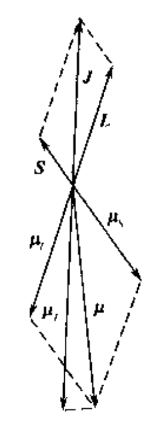

.. only:: html

    .. math::
        \renewenvironment{equation*}
        {\begin{equation}\begin{aligned}}
        {\end{aligned}\end{equation}}
        \renewcommand{\gg}{>\!\!>}
        \renewcommand{\ll}{<\!\!<}
        \newcommand{\I}{\mathrm{i}}
        \newcommand{\D}{\mathrm{d}}
        \renewcommand{\C}{\mathrm{C}}
        \newcommand{\dt}{\frac{\D}{\D t}}
        \newcommand{\E}{\mathrm{e}}
        \newcommand{\xtensor}[3]{{#1}#2 {\vphantom{#1}}#3}
        \renewcommand{\bm}{\mathbf}

凝聚态磁性物理
============================

电子及组成原子核的质子, 中子都具有一定的磁矩, 所以宏观物质都毫无例外地是磁性物质.
电子的质量比质子, 中子的质量约小三个数量级, 这使电子的磁矩比质子, 中子的磁矩约大三个数量级.
所以, 宏观物质的磁性主要由电子的磁矩所决定.

电子的轨道磁矩
---------------------

宏观物质中的电子按照运动状态分为轨道电子和传导电子.
这两类电子对磁性的贡献具有不同的规律, 因此需要分别处理.
先讨论核外轨道电子的磁矩.

经典的图像
^^^^^^^^^^^^^^

首先考虑一个环形电流. 电流 I = e / T, e 为电子电荷, T 为运动周期. 其产生的磁矩为 mu = I A, 其中 A 为环形电流所围的面积.
电子的轨道角动量为 P r x p = r^2 x m dphi/dt, 其中 m 为电子质量, phi 为角坐标, r 为位置矢量.

回到最开始的公式 mu = e A / T 这是一个周期的平均值. 那么瞬时值即为 mu = e dA/dt, 单位时间扫过一个小扇形.
进一步, mu = e (1/2) r^2 dphi / dt = e/(2m) P

这里就得到了 mu = (e/2m) P. 在量子化的时候, 直接将 P 量子化就行了.

量子的图像
^^^^^^^^^^^^^^

按照量子力学理论, 轨道电子用波函数表示, 波函数有四个量子数 n, l, ml, ms. 前三个为空间量子数, 第四个为自旋空间量子数.

1. n = 1,2,3, ... 称为主量子数, 它决定电子的能量 [即, 如果一堆电子具有相同的 n, 它们的能量是简并的.
不同的 l 的电子都具有相同的能量.
那么为什么后面把分子轨道按对称性不可约表示分类, 那些轨道又不简并? 因为那种情况下实际上已经没有了 n, 点群是 n 和 l 的混合]

2. l = 0,1,2,... n-1, 称为轨道角动量量子数, 它决定了轨道角动量的绝对值 :math:`P_l = \sqrt{l(l+1)} \hbar`.

3. ml = -l,-l+1, ... l 称为磁量子数, 决定轨道角动量的投影. :math:`P_lz = m\hbar`.

上式说明, 电子的轨道角动量在空间的取向是量子化的.

所以电子轨道磁矩的绝对值为

.. math::
    \mu_l = \sqrt{l(l+1)}\frac{e\hbar}{2m} = \sqrt{l(l+1)} \mu_B

电子轨道磁矩在空间任意方向的投影为

.. math::
    \mu_l^z = m_l \mu_B

由于电子所带电荷为负电荷, 电子的轨道磁矩 :math:`\bm{\mu}_l` 与轨道角动量 :math:`\bm{P}_l` 的方向相反.

玻尔磁子是物质磁矩的最小单元

.. math::
    \mu_B = \frac{e\hbar}{2m} = 9.274\times 10^{-24} A\cdot m^2

电子的自旋磁矩 (内禀磁矩)
-----------------------------

电子自旋角动量量子数 :math:`\bm{\sigma}` 为 :math:`s = (1/2) \hbar` (绝对值为 :math:`s(s+1) \hbar`), 投影值为 :math:`m_s = \pm (1/2) \hbar`.
电子自旋磁矩在外磁场方向投影是

.. math::
    \mu_s^z = 2 m_s \mu_B

电子具有自旋磁矩的实验证明是斯特恩和盖拉赫做的原子束在不均匀磁场中偏转的实验.
理论是狄拉克方程.

磁矩与对应的角动量的比率称为旋磁比, 以 :math:`\gamma` 表示.
对轨道磁矩, :math:`\gamma_l = e/2m`. 对自旋磁矩, :math:`\gamma_s = e/m`.

如设 :math:`\gamma = g \frac{e}{2m}`, 则 :math:`g_l = 1, g_s = 2`.
注意, 剩余的情况是原子核自旋的因子, 会更奇怪. 这里角动量和磁矩实验分别可测量, 因此便有了这个因子.

原子的磁性
---------------------

核外电子在构造原子壳层时遵守两个原理:

1. 泡利不相容原理: 每个电子状态只允许一个电子, 即任何两个电子的四个量子数都不会完全相同.
2. 最低能量原理: 电子优先占据能量低的状态.

按照以上原则构造原子结构, 主量子数 n 代表主壳层, 轨道量子数 l 代表支壳层 l = 0,1,2,... 分别用字母 spd.. 表示.
在同一支壳层最多可以容纳 2(2l+1) 个电子. [其中2 来自电子自旋自由度, 2l+1来自轨道空间自由度. 支壳层来自于空间球对称性].

当原子中包含多个电子时, 各支壳层电子首先按角动量耦合定则合成一个总角动量.
角动量耦合有两种方式: LS 耦合 和 JJ 耦合.

LS 耦合发生在原子序数较小的原子. 在这类原子, 不同电子之间轨道-轨道耦合和自旋-自旋耦合较强, 而同一电子内轨道-自旋耦合较弱.
[这其实就是旋轨耦合效应在前几周期可以不考虑]
各电子轨道角动量首先合成一个总轨道角动量, 各电子的自旋角动量首先合成总自旋角动量.
然后 L 和 S 再耦合成总角动量 J.

j-j 耦合发生在原子序数较大 (Z>82) 的原子. 同一电子的轨道-自旋耦合较强, 两者先合成单电子总角动量.
然后各个电子的总角动量再合成整个总角动量 J [这里还是有一个问题, 按照角动量理论, 不同耦合顺序是等价的.
为什么这里耦合顺序会和实际体系有关?]

原子序数不太大的原子 (如我们经常遇到的 3d, 4f 元素) 基态或低激发态, 均属于 LS 耦合,
纯 jj 耦合只发生在较重元素激发态中.

下面以原子的某一支壳层 (以下简称壳层) 包含两个电子为例说明 LS 耦合计算方法.

LS 耦合计算方法
^^^^^^^^^^^^^^^^^^^

设两电子的轨道角动量量子数分别为 :math:`l_1, l_2`. 则总轨道量子数

.. math::
    L = l_1+l_2,\cdots , |l_1-l_2|

对确定的 L 值, 总轨道角动量 :math:`\bm{L}`, 总轨道磁矩 :math:`\bm{\mu}_L` 绝对值为

.. math::
    |\bm{L}| =&\ \sqrt{L(L+1)}\hbar \\
    |\bm{\mu}_L| =&\ \sqrt{L(L+1)}\mu_B

对自旋有 [实际上对两个电子 :math:`s_1, s_2` 必为 :math:`1/2`]

.. math::
    S = s_1+s_2,\cdots |s_1-s_2|

于是

.. math::
    |\bm{S}| =&\ \sqrt{S(S+1)}\hbar \\
    |\bm{\mu}_S| =&\ 2\sqrt{S(S+1)}\mu_B

假定原子某壳层只有上述两个电子, 则其总角动量 :math:`\bm{J}` 应取为 :math:`\bm{L}` 和 :math:`\bm{S}` 的矢量和

.. math::
    \bm{J} + \bm{L} +\bm{S}

[注意实验上不可能测得总角动量或者自旋角动量. 这只是理论模型]

如果 :math:`L>S`, 总角动量量子数 :math:`J` 可以取以下数值

.. math::
    J = L+S,L+S-1,\cdots, L-S

如果 :math:`L<S`, 总角动量量子数 :math:`J` 可以取以下数值

.. math::
    J = L+S,L+S-1,\cdots, S-L

总角动量 :math:`J` 的绝对值为

.. math::
    |\bm{J}| = \sqrt{J(J+1)} \hbar

:math:`\bm{J}` 在空间任意方向的投影仍适合空间量子化规则.

值得注意的是, 总角动量 :math:`\bm{J}` 并不能立即给出总磁矩 :math:`\bm{\mu}`.
这是因为电子自旋的旋磁比 :math:`\gamma_s` 为轨道的旋磁比的2倍.
因此原子的总磁矩 :math:`\bm{\mu}` 的方向与其总角动量 :math:`\bm{J}` 的方向并不重合.
用经典的说法, 矢量 :math:`\bm{L}` 和 :math:`\bm{S}` 绕着矢量 :math:`\bm{J}` 进动,
因此 :math:`\bm{\mu}_L` 和 :math:`\bm{\mu}_S` 也应绕着矢量 :math:`\bm{J}` 进动,
[因为在自旋轨道分开考虑时, 分量的 mu 总是和角动量反平行的, 乘以二与否不影响反平行.]
而 :math:`\bm{\mu}_L` 和 :math:`\bm{\mu}_S` 垂直于 :math:`\bm{J}` 的分量在一个进动周期平均值为零.
因此原子的有效磁矩等于 :math:`\bm{\mu}_L` 和 :math:`\bm{\mu}_S` 平行于 :math:`\bm{J}` 的分量之和, 即

.. math::
    \mu_J = \mu_L \cos(\bm{L}, \bm{J}) + \mu_S \cos(\bm{S}, \bm{J})

   图 1.3

由图中 :math:`\bm{L}, \bm{S}, \bm{J}` 的三角形关系 [注意这里并非直角三角形, 需要使用余弦定理]

.. math::
    \cos(\bm{L}, \bm{J}) =&\ \frac{L(L+1) + J(J+1)-S(S+1)}{2\sqrt{L(L+1)J(J+1)}} \\
    \cos(\bm{S}, \bm{J}) =&\ \frac{S(S+1) + J(J+1)-L(L+1)}{2\sqrt{S(S+1)J(J+1)}}

于是

.. math::
    \mu_J =&\ \sqrt{L(L+1)}\mu_B \cos(\bm{L}, \bm{J}) + 2\sqrt{S(S+1)}\mu_B \cos(\bm{S}, \bm{J}) \\
    =&\ \Big[ \frac{L(L+1) + J(J+1)-S(S+1)}{2\sqrt{J(J+1)}}
    + \frac{S(S+1) + J(J+1)-L(L+1)}{\sqrt{J(J+1)}} \Big] \mu_B \\
    =&\  \frac{-L(L+1) + 3J(J+1)+S(S+1)}{2J(J+1)} \sqrt{J(J+1)} \mu_B \\
    =&\ \bigg[ 1 + \frac{J(J+1)+S(S+1)-L(L+1)}{2J(J+1)} \bigg] \sqrt{J(J+1)} \mu_B \\
    =&\ g_J \sqrt{J(J+1)} \mu_B

其中

.. math::
    g_J =  1 + \frac{J(J+1)+S(S+1)-L(L+1)}{2J(J+1)}

称为朗德因子或光谱分裂因子.

由上式可知, 在纯粹自旋磁矩的情况, :math:`g_J = 2`. 在纯粹轨道磁矩的情况, :math:`g_J = 1`. 符合原来的情况.

以上计算表明, :math:`L,S` 和 :math:`J` 有多种取值方式, 因而它们中的哪一组数值对应于系统的最低能量因而是稳定状态下的取值?
这需要借助洪德定则. [这其实是根据能级占据, 再考虑有效电子的有效角动量的方案. 上述讨论是完全基于对称性的,
对称性给出允许的解. 而后面的讨论是哪个解对应真实情况.]

洪德定则
------------

该定则是洪德基于对原子光谱分析而总结出来的经验法则.
它给出了含有未满电子壳层的原子 (或离子) 的基态量子数, 其内容包括以下 3 条:

1. 在泡利原理许可的条件下, 总自旋量子数 :math:`S = \sum_i s_i` 取最大值.
2. 在满足条件1并遵守泡利原理的前提下, 总轨道量子数 :math:`L = \sum_i m_{li}` 取最大值.
3. 当电子数未达到电子壳层总电子数的一半时, 总角动量量子数 :math:`J=L-S`, 当电子数达到或超过电子壳层总电子数的一半时, :math:`J=L+S`.

有时将原子的量子态用光谱学的标记写为 :math:`{}^{2S+1}L_J`, 其中 :math:`L` 表示总轨道量子数.
当 :math:`L=0,1,2,3,\cdots` 时, 分别用符号 :math:`S,P,D,\cdots` 表示.

下面举例说明洪德定则的应用和原子态量子数的光谱学表示法.

[例一] 计算 :math:`\mathrm{Co}^{2+}` 离子的基态磁矩并用光谱学标记表示基态.

:math:`\mathrm{Co}^{2+}` 离子未满壳层的电子组态为 :math:`3d^7`.
按洪德定则, :math:`\sum_i m_{si} = 5\times \frac{1}{2} + 2\times \big(-\frac{1}{2}\big) = \frac{3}{2}`.
:math:`\sum_i m_{li} = 3`. 因而有 :math:`S = \frac{3}{2}, L = 3, J = 3+ 3/2 = 9/2`.
基态为 :math:`{}^4F_{9/2}`.
[注意这里3d 轨道最多可填充10个电子, 这里有7个电子, 超过半数.
配对电子不贡献总自旋, 因此, 必须有2对配对的, 剩余3个未配对电子, 得到总自旋 3/2.
对于轨道角动量而言, 可取的值为 -2,-1,0,1,2. 每个值最多用两次. 一共用7次. 为了使总和尽量大, 挑选 1,2 作为配对电子的.
因此 得 L = (1+2)*2 + (0-2-1) * 1 = 3. J = 9/2. J(J+1) = 99/4. S(S+1) =15/4. L(L+1) = 12=48/4.
g = 1 + (99+15-48)/(99 + 99) = 4/3]
而 :math:`g_J = 4/3, \mu_J = 4/3 \times \sqrt{\frac{9}{2} \times \frac{11}{2}} \mu_B = 6.63 \mu_B`.
:math:`\mathrm{Co}^{2+}` 离子磁矩的实验值为 :math:`4.8 \mu_B`, 理论值与实验值相差较大.

这个实验值在手册 CRC handbook of chemistry and physics: a ready-reference book of chemical and physical data
第 12-109 页.

https://physics.nist.gov/PhysRefData/Handbook/element_name.htm 只有能级, 没有磁矩.

[例二] 计算 :math:`\mathrm{Nd}^{3+}` 离子的基态磁矩并用光谱学中的标记表示出基态.

:math:`\mathrm{Nd}^{3+}` 离子未满壳层的电子组态为 :math:`4f^3`. [原子是 :math:`6s^2 4f^4`]
按照洪德定则, :math:`\sum_i m_{si} = 3\times \frac{1}{2} = \frac{3}{2}`.
:math:`\sum_i m_{li} = 3 + 2 + 1 = 6`. 因而有 :math:`S = \frac{3}{2}, L = 6, J = 6 - 3/2 = 9/2`.
基态为 :math:`{}^4I_{9/2}`.
[J(J+1) = 99/4. S(S+1) =15/4. L(L+1) = 42=168/4. g = 1 + (99+15-168)/(99 + 99) = 8 / 11]
而 :math:`g_J = 8/11, \mu_J = 8/11 \times \sqrt{\frac{9}{2} \times \frac{11}{2}} \mu_B = 3.62 \mu_B`.
:math:`\mathrm{Nd}^{3+}` 离子磁矩的实验值为 :math:`3.5 \mu_B`, 理论值与实验值基本符合.